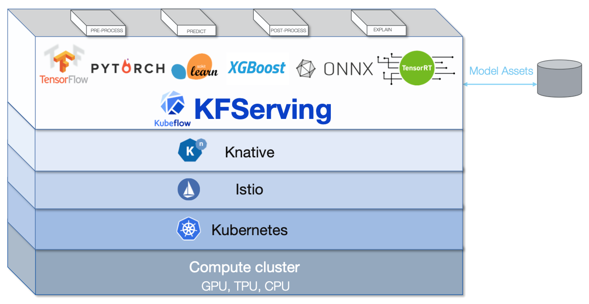

# KFServing
KFServing provides a Kubernetes [Custom Resource Definition](https://kubernetes.io/docs/concepts/extend-kubernetes/api-extension/custom-resources/) for serving ML Models on arbitrary frameworks. It aims to solve 80% of model serving use cases by providing performant, high abstraction interfaces for common ML frameworks like Tensorflow, XGBoost, ScikitLearn, PyTorch, and ONNX. 

KFServing encapsulates the complexity of autoscaling, networking, health checking, and server configuration to bring cutting edge serving features like GPU Autoscaling, Scale to Zero, and Canary Rollouts to your ML deployments. It enables a simple, pluggable, and complete story for Mission Critical ML including inference, explainability, outlier detection, and prediction logging.

### Learn More
* Join our [Working Group](https://groups.google.com/forum/#!forum/kfserving) for meeting invites and discussion.
* [Read the Docs](/docs).
* [Examples](./docs/samples).
* [Roadmap](/ROADMAP.md).
* [KFServing 101 Slides](https://drive.google.com/file/d/16oqz6dhY5BR0u74pi9mDThU97Np__AFb/view).
* [KFServing 101 Tech Talk](https://www.youtube.com/watch?v=hGIvlFADMhU).
* This project is an evolution of the [original proposal in the Kubeflow repo](https://github.com/kubeflow/kubeflow/issues/2306). 

### Prerequisits
KNative Serving and Istio should be available on Kubernetes Cluster.
- Istio Version: v1.1.7 + 
- Knative Version: v0.8.0 +

You may find this [installation instruction](https://github.com/kubeflow/kfserving/blob/master/docs/DEVELOPER_GUIDE.md#install-knative-on-a-kubernetes-cluster) useful.

### Install ###
```
TAG=v0.1.0
kubectl apply -f ./install/$TAG/kfserving.yaml
```

### Use ###
* Install the SDK
```
pip install kfserving
```
* Follow the [example here](docs/samples/client/kfserving_sdk_sample.ipynb) to use the KFServing SDK to create, patch, and delete a InferenceService instance.

### Contribute
* [Developer Guide](/docs/DEVELOPER_GUIDE.md).


