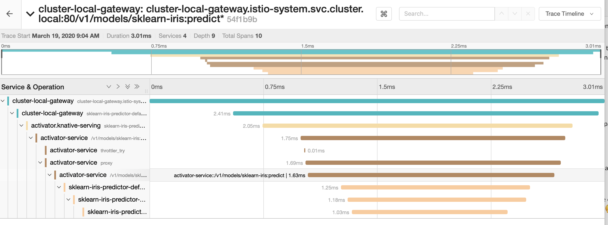

# Debug KFServing InferenceService Status
You deployed an InferenceService to KFServing, but it is not in ready state. Go through this step by step guide to understand what failed.
```bash
kubectl get inferenceservices sklearn-iris 
NAME                  URL   READY   DEFAULT TRAFFIC   CANARY TRAFFIC   AGE
model-example               False                                      1m
```

KFServing `InferenceService` creates [Knative Service](https://knative.dev/docs/serving/spec/knative-api-specification-1.0/#service) under the hood to instantiate a 
serverless container.

## IngressNotConfigured
If you see `IngressNotConfigured` error, this indicates `Istio Ingress Gateway` probes are failing.

```bash
kubectl get ksvc
NAME                             URL                                                            LATESTCREATED                          LATESTREADY                            READY     REASON
sklearn-iris-predictor-default   http://sklearn-iris-predictor-default.default.example.com   sklearn-iris-predictor-default-jk794   mnist-sample-predictor-default-jk794   Unknown   IngressNotConfigured
```
You can check Knative `networking-istio` pod logs for more details.
```shell
kubectl logs -l app=networking-istio -n knative-serving
```
If you are seeing HTTP 401 or 302, then you may have Auth turned on for `Istio Ingress Gateway` which blocks the Knative probes to your service.

```shell
[2020-02-11T18:16:21.419Z] "GET / HTTP/1.1" 404 NR "-" "-" 0 0 0 - "10.88.0.31" "Go-http-client/1.1" "4a8bd584-2323-4f40-9230-9797d890b9fb" "helloworld-go.default:80" "-" - - 10.88.1.13:80 10.88.0.31:36237 - -
[2020-02-11T18:16:21.419Z] "GET / HTTP/1.1" 404 NR "-" "-" 0 0 0 - "10.88.0.31" "Go-http-client/1.1" "7298dbfc-58bb-430f-92c5-cf39e97f63d7" "helloworld-go.default.svc:80" "-" - - 10.88.1.13:80 10.88.0.31:36239 - -
[2020-02-11T18:16:21.420Z] "GET / HTTP/1.1" 302 UAEX "-" "-" 0 269 21 21 "10.88.0.31" "Go-http-client/1.1" "27aa43fa-ac17-4a71-8ca2-b4d9fb772219" "helloworld-go.default.example.com:80" "-" - - 10.88.1.13:80 10.88.0.31:36249 - -
```

If you are seeing HTTP 403, then you may have `Istio RBAC` turned on which blocks the probes to your service.
```json
{"level":"error","ts":"2020-03-26T19:12:00.749Z","logger":"istiocontroller.ingress-controller.status-manager","caller":"ingress/status.go:366",
"msg":"Probing of http://flowers-sample-predictor-default.kubeflow-jeanarmel-luce.example.com:80/ failed, IP: 10.0.0.29:80, ready: false, error: unexpected status code: want [200], got 403 (depth: 0)",
"commit":"6b0e5c6","knative.dev/controller":"ingress-controller","stacktrace":"knative.dev/serving/pkg/reconciler/ingress.(*StatusProber).processWorkItem\n\t/home/prow/go/src/knative.dev/serving/pkg/reconciler/ingress/status.go:366\nknative.dev/serving/pkg/reconciler/ingress.(*StatusProber).Start.func1\n\t/home/prow/go/src/knative.dev/serving/pkg/reconciler/ingress/status.go:268"}
``` 

Knative has addressed this [probe issue](https://github.com/knative/serving/issues/6829) with best effort probes and the fix has been back ported to `Knative 0.11.2` release and `Knative 0.14.0+` onward, the same fix 
has been ported to [Kubeflow manifest master](https://github.com/kubeflow/manifests/archive/master.tar.gz).


## RevisionMissing Error
If you see `RevisionMissing` error, then your service pods are not in ready state. `Knative Service` creates [Knative Revision](https://knative.dev/docs/serving/spec/knative-api-specification-1.0/#revision) 
which represents a snapshot of the `InferenceService` code and configuration.


### Storage Initializer fails to download model
```bash
kubectl get revision $(kubectl get configuration sklearn-iris-predictor-default --output jsonpath="{.status.latestCreatedRevisionName}") 
NAME                                   CONFIG NAME                      K8S SERVICE NAME                       GENERATION   READY     REASON
sklearn-iris-predictor-default-csjpw   sklearn-iris-predictor-default   sklearn-iris-predictor-default-csjpw   2            Unknown   Deploying
```

If you see `READY` status in `Unknown` error, this usually indicates that the KFServing `Storage Initializer` init container fails to download the model and you can
check the init container logs to see why it fails, **note that the pod scales down after sometime if the init container fails**. 
```bash
kubectl get pod -l model=sklearn-iris
NAME                                                              READY   STATUS       RESTARTS   AGE
sklearn-iris-predictor-default-29jks-deployment-5f7d4b9996hzrnc   0/3     Init:Error   1          10s

kubectl logs -l model=sklearn-iris -c storage-initializer
[I 200517 03:56:19 initializer-entrypoint:13] Initializing, args: src_uri [gs://kfserving-samples/models/sklearn/iris-1] dest_path[ [/mnt/models]
[I 200517 03:56:19 storage:35] Copying contents of gs://kfserving-samples/models/sklearn/iris-1 to local
Traceback (most recent call last):
  File "/storage-initializer/scripts/initializer-entrypoint", line 14, in <module>
    kfserving.Storage.download(src_uri, dest_path)
  File "/usr/local/lib/python3.7/site-packages/kfserving/storage.py", line 48, in download
    Storage._download_gcs(uri, out_dir)
  File "/usr/local/lib/python3.7/site-packages/kfserving/storage.py", line 116, in _download_gcs
    The path or model %s does not exist." % (uri))
RuntimeError: Failed to fetch model. The path or model gs://kfserving-samples/models/sklearn/iris-1 does not exist.
[I 200517 03:40:19 initializer-entrypoint:13] Initializing, args: src_uri [gs://kfserving-samples/models/sklearn/iris] dest_path[ [/mnt/models]
[I 200517 03:40:19 storage:35] Copying contents of gs://kfserving-samples/models/sklearn/iris to local
[I 200517 03:40:20 storage:111] Downloading: /mnt/models/model.joblib
[I 200517 03:40:20 storage:60] Successfully copied gs://kfserving-samples/models/sklearn/iris to /mnt/models
```

### Inference Service in OOM status
If you see `ExitCode137` from the revision status, this means the revision has failed and this usually happens when the inference service pod is out of memory. To address it, you might need to bump up the
memory limit of the `InferenceService`.
```bash
kubectl get revision $(kubectl get configuration sklearn-iris-predictor-default --output jsonpath="{.status.latestCreatedRevisionName}") 
NAME                                   CONFIG NAME                      K8S SERVICE NAME                       GENERATION   READY   REASON
sklearn-iris-predictor-default-84bzf   sklearn-iris-predictor-default   sklearn-iris-predictor-default-84bzf   8            False   ExitCode137s
```

### Inference Service fails to start
If you see other exit codes from the revision status you can further check the pod status.
```bash
kubectl get pods -l model=sklearn-iris
sklearn-iris-predictor-default-rvhmk-deployment-867c6444647tz7n   1/3     CrashLoopBackOff        3          80s
```

If you see the `CrashLoopBackOff`, then check the `kfserving-container` log to see more details where it fails, the error log is usually propagated on revision container status also.
```bash
kubectl logs sklearn-iris-predictor-default-rvhmk-deployment-867c6444647tz7n  kfserving-container
[I 200517 04:58:21 storage:35] Copying contents of /mnt/models to local
Traceback (most recent call last):
  File "/usr/local/lib/python3.7/runpy.py", line 193, in _run_module_as_main
    "__main__", mod_spec)
  File "/usr/local/lib/python3.7/runpy.py", line 85, in _run_code
    exec(code, run_globals)
  File "/sklearnserver/sklearnserver/__main__.py", line 33, in <module>
    model.load()
  File "/sklearnserver/sklearnserver/model.py", line 36, in load
    model_file = next(path for path in paths if os.path.exists(path))
StopIteration
```

### Inference Service cannot fetch docker images from AWS ECR
If you don't see the inference service created at all for custom images from private registries (such as AWS ECR), it might be that the Knative Serving Controller fails to authenticate itself against the registry.

```bash
failed to resolve image to digest: failed to fetch image information: unsupported status code 401; body: Not Authorized
```

You can verify that this is actually the case by spinning up a pod that uses your image. The pod should be able to fetch it, if the correct IAM roles are attached, while Knative is not able to. To circumvent this issue you can either skip tag resolution or provide certificates for your registry as detailed in [the official knative docs](https://knative.dev/docs/serving/tag-resolution/).

 ```bash
kubectl -n knative-serving edit configmap config-deployment
```

```yaml
apiVersion: v1
kind: ConfigMap
metadata:
  name: config-deployment
  namespace: knative-serving
data:
  # List of repositories for which tag to digest resolving should be skipped (for AWS ECR: {account_id}.dkr.ecr.{region}.amazonaws.com)
  registriesSkippingTagResolving: registry.example.com
```

# Debug KFServing Request flow

```
  +----------------------+        +-----------------------+      +--------------------------+
  |Istio Virtual Service |        |Istio Virtual Service  |      | K8S Service              |
  |                      |        |                       |      |                          |
  |sklearn-iris          |        |sklearn-iris-predictor |      | sklearn-iris-predictor   |
  |                      +------->|  -default             +----->|   -default-$revision     |
  |                      |        |                       |      |                          |
  |KFServing Route       |        |Knative Route          |      | Knative Revision Service |
  +----------------------+        +-----------------------+      +------------+-------------+
   Istio Ingress Gateway           Istio Local Gateway                    Kube Proxy
                                                                              |
                                                                              |
                                                                              |
  +-------------------------------------------------------+                   |
  |  Knative Revision Pod                                 |                   |
  |                                                       |                   |
  |  +-------------------+      +-----------------+       |                   |
  |  |                   |      |                 |       |                   |
  |  |kfserving-container|<-----+ Queue Proxy     |       |<------------------+
  |  |                   |      |                 |       |
  |  +-------------------+      +--------------^--+       |
  |                                            |          |
  +-----------------------^-------------------------------+
                          | scale deployment   |
                 +--------+--------+           | pull metrics
                 |  Knative        |           |
                 |  Autoscaler     |-----------
                 |  KPA/HPA        |
                 +-----------------+
```
1. Traffic arrives through:
   - The `Istio Ingress Gateway` for external traffic
   - The `Istio Cluster Local Gateway` for internal traffic
   
`Istio Gateway` describes the edge of the mesh receiving incoming or outgoing HTTP/TCP connections. The specification describes a set of ports
that should be exposed and the type of protocol to use. If you are using `Standalone KFServing`, it uses the `Gateway` in `knative-serving` namespace,
if you are using `Kubeflow KFServing`(KFServing installed with Kubeflow), it uses the `Gateway` in `kubeflow` namespace e.g on GCP the gateway is protected behind `IAP` with [Istio 
authentication policy](https://istio.io/docs/tasks/security/authentication/authn-policy).
```bash
kubectl get gateway knative-ingress-gateway -n knative-serving -oyaml
```
```yaml
kind: Gateway
metadata:
  labels:
    networking.knative.dev/ingress-provider: istio
    serving.knative.dev/release: v0.12.1
  name: knative-ingress-gateway
  namespace: knative-serving
spec:
  selector:
    istio: ingressgateway
  servers:
  - hosts:
    - '*'
    port:
      name: http
      number: 80
      protocol: HTTP
  - hosts:
    - '*'
    port:
      name: https
      number: 443
      protocol: HTTPS
    tls:
      mode: SIMPLE
      privateKey: /etc/istio/ingressgateway-certs/tls.key
      serverCertificate: /etc/istio/ingressgateway-certs/tls.crt
```
The `InferenceService` request hitting the `Istio Ingress Gateway` first matches the network port, by default http is configured. You can [configure
HTTPS with TLS certificates](https://knative.dev/docs/serving/using-a-tls-cert).
 
2. KFServing creates a `Istio virtual service` to specify routing rule for predictor, transformer, explainer and canary
```bash
kubectl get vs sklearn-iris -oyaml
```
```yaml
apiVersion: networking.istio.io/v1alpha3
kind: VirtualService
metadata:
  name: sklearn-iris
  namespace: default
spec:
  gateways:
  - knative-ingress-gateway.knative-serving
  - knative-serving/cluster-local-gateway
  hosts:
  - sklearn-iris.default.example.com
  - sklearn-iris.default.svc.cluster.local
  http:
  - match:
    - authority:
        regex: ^sklearn-iris.default\.default\.example\.com(?::\d{1,5})?$
      gateways:
      - knative-ingress-gateway.knative-serving
      uri:
        prefix: /v1/models/sklearn-iris:predict
    - authority:
        regex: ^sklearn-iris\.default(\.svc(\.cluster\.local)?)?(?::\d{1,5})?$
      gateways:
      - knative-serving/cluster-local-gateway
      uri:
        prefix: /v1/models/sklearn-iris:predict
    retries:
      attempts: 3
      perTryTimeout: 600s
    route:
    - destination:
        host: cluster-local-gateway.istio-system.svc.cluster.local
        port:
          number: 80
      headers:
        request:
          set:
            Host: sklearn-iris-predictor-default.default.svc.cluster.local
      weight: 100
```
- KFServing creates the routing rule based on uri prefix according to [KFServing V1 data plane](./README.md#data-plane-v1) and traffic
is forwarded to `KFServing Predictor` if you only have `Predictor` specified on `InferenceService`,
note that if you have custom container and the endpoint is not conforming to the protocol you get `HTTP 404` when you hit the KFServing
top level virtual service.
- When `Transformer` and `Explainer` are specified on `InferenceService` the routing rule sends the traffic to `Transformer`
or `Explainer` based on the verb.
- The top level virtual service also does `Canary Traffic Split` if canary is specified on `InferenceService`.

3. KNative creates a `Istio virtual service` to configure the gateway to route the user traffic to correct revision
The request then hits `Knative` created virtual service via local gateway, it matches with the in cluster host name.
```bash
kubectl get vs sklearn-iris-predictor-default -oyaml
```
```yaml
apiVersion: networking.istio.io/v1alpha3
kind: VirtualService
metadata:
  name: sklearn-iris-predictor-default-mesh
  namespace: default
spec:
  gateways:
  - mesh
  hosts:
  - sklearn-iris-predictor-default.default
  - sklearn-iris-predictor-default.default.svc
  - sklearn-iris-predictor-default.default.svc.cluster.local
  http:
  - headers:
      request:
        set:
          K-Network-Hash: dee002f4a2db24e3827d8088b7ddacf3
    match:
    - authority:
        prefix: sklearn-iris-predictor-default.default
      gateways:
      - mesh
    retries:
      attempts: 3
      perTryTimeout: 600s
      retryOn: 5xx,connect-failure,refused-stream,cancelled,resource-exhausted,retriable-status-codes
    route:
    - destination:
        host: sklearn-iris-predictor-default-fhmjk.default.svc.cluster.local
        port:
          number: 80
      headers:
        request:
          set:
            Knative-Serving-Namespace: default
            Knative-Serving-Revision: sklearn-iris-predictor-default-fhmjk
      weight: 100
    timeout: 600s
    websocketUpgrade: true
```
The destination here is the `k8s Service` for the latest ready `Knative Revision` and it is reconciled by `Knative` every time
user rolls out a new revision. When a new revision is rolled out and in ready state, the old revision is then scaled down, after
configured revision GC time the revision resource is garbage collected if the revision no longer has traffic referenced.

4. Once the revision pods are ready, the `Kubernetes Service` sends the requests to the `queue proxy` sidecar on `port 8012`.
```bash
kubectl get svc sklearn-iris-predictor-default-fhmjk-private -oyaml
```
```yaml
apiVersion: v1
kind: Service
metadata:
  name: sklearn-iris-predictor-default-fhmjk-private
  namespace: default
spec:
  clusterIP: 10.105.186.18
  ports:
  - name: http
    port: 80
    protocol: TCP
    targetPort: 8012
  - name: queue-metrics
    port: 9090
    protocol: TCP
    targetPort: queue-metrics
  - name: http-usermetric
    port: 9091
    protocol: TCP
    targetPort: http-usermetric
  - name: http-queueadm
    port: 8022
    protocol: TCP
    targetPort: 8022
  selector:
    serving.knative.dev/revisionUID: a8f1eafc-3c64-4930-9a01-359f3235333a
  sessionAffinity: None
  type: ClusterIP

```
5. The `queue proxy` sends single or multi-threaded requests that the `kfserving container` can handle at a time.
If the `queue proxy` has more requests than it can handle, the [Knative Autoscaler](https://knative.dev/docs/serving/configuring-autoscaling/)
creates more pods to handle additional requests.

6. Finally The `queue proxy` sends traffic to the `kfserving-container`.

### Investigate Performance Issues
You deployed your `InferenceService` but its performance does not meet your expectations. `Knative Serving` provides various
dashboard and tools to help investigate such issues. You can follow up [Knative performance investigation](https://knative.dev/docs/serving/debugging-performance-issues/)
doc to diagnose `InferenceService` performance with [metrics](https://knative.dev/docs/serving/accessing-metrics/) and [distributed tracing](https://knative.dev/docs/serving/accessing-traces/).



### KNative Probes are failing
You have deployed your `InferenceService` in your custom namespace(any other than kubeflow specific namespaces) but the probes are failing you are often getting `IngressNotConfigured` errors. Please check Knative `activator`, `controller` pod logs to see if you face any specific errors related to RBAC or probes failing. 

Check your ClusterRbacConfig definition, `kubectl edit clusterrbacconfig default` ensure appropriate policy is selected for your custom namepsace. See issue 
[1153](https://github.com/kubeflow/kfserving/issues/1153) for more details
