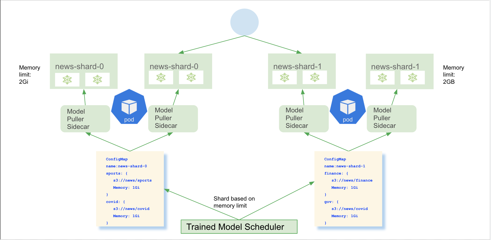
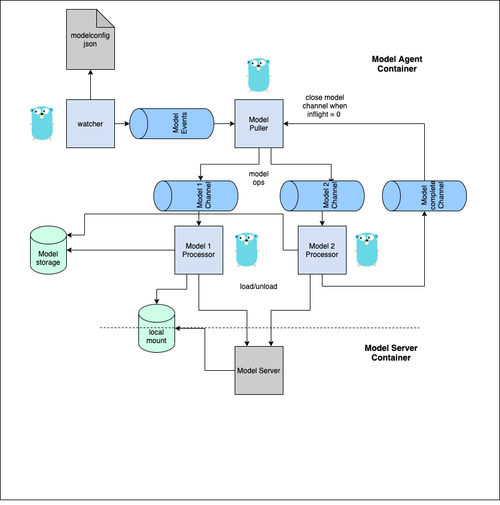

# Multi-Model Serving
Multi-model serving is an [alpha](https://kubernetes.io/docs/reference/using-api/#api-versioning) 
feature added recently to increase KFServing’s scalability.
Please assume that the interface is subject to changes.

## The model deployment scalability problem
With machine learning approaches becoming more widely adopted in organizations, 
there is a trend to deploy a large number of models. 
For example, a news classification service may train custom models for each news category. 
Another important reason why organizations desire to train a lot of models is to protect data privacy,
as it is safer to isolate each user's data and train models separately. 
While you get the benefit of better inference accuracy and data privacy by building models for each use case, 
it is more challenging to deploy thousands to hundreds of thousands of models on a Kubernetes cluster. 
Furthermore, there are an increasing number of use cases of serving neural network-based models. 
To achieve reasonable latency, those models are better served on GPUs. 
However, since GPUs are expensive resources, it is costly to serve many GPU-based models.

The original design of KFServing deploys one model per InferenceService. 
But, when dealing with a large number of models,  its 'one model, one server' paradigm presents challenges for a Kubernetes cluster. 
To scale the number of models, we have to scale the number of InferenceServices, 
something that can quickly challenge the cluster's limits.

Multi-model serving is designed to address three types of limitations KFServing will run into: 1) Compute resource limitation, 2) Maximum pods limitation, 3) Maximum IP address limitation.

### Compute resource limitation
Each InferenceService has a resource overhead because of the sidecars injected into each pod. 
This normally adds about 0.5 CPU and 0.5G Memory resource per InferenceService replica. 
For example, if we deploy 10 models, each with 2 replicas, then the resource overhead is 10 * 2 * 0.5 = 10 CPU and 10 * 2 * 0.5 = 10 GB memory. 
Each model’s resource overhead is 1CPU and 1 GB memory. 
Deploying many models using the current approach will quickly use up a cluster's computing resource. 
With Multi-model serving, these models can be loaded in one InferenceService, 
then each model's average overhead is 0.1 CPU and 0.1GB memory.
For GPU based models, the number of GPUs required grows linearly as the number of models grows, which is not cost efficient. 
If multiple models can be loaded in one GPU enabled model server such as TritonServer, we need a lot less GPUs in the cluster.

### Maximum pods limitation
Kubelet has a maximum number of pods per node with the default limit set to [110](https://kubernetes.io/docs/reference/command-line-tools-reference/kubelet/).
According to Kubernetes best [practice](https://kubernetes.io/docs/setup/best-practices/cluster-large/), 
a node shouldn't run more than 100 pods.  
With this limitation, a typical 50-node cluster with default pod limit can run at most 1000 models
 assuming each InferenceService has 4 pods on average (two transformer replicas and two predictor replicas).

### Maximum IP address limitation.
Kubernetes clusters also have an IP address limit per cluster. 
Each pod in InferenceService needs an independent IP. 
For example a cluster with 4096 IP addresses can deploy at most 1024 models assuming each InferenceService has 4 pods on average (two transformer replicas and two predictor replicas).

## Benefit of using Multi-Model serving
The Multi-model serving feature is designed to address the three limitations above. 
It decreases the average resource overhead per model so model deployment becomes more cost efficient. 
And the number of models which can be deployed in a cluster will no longer be limited 
by the maximum pods limitation and the maximum IP address limitation.

The [benchmark test results](./samples/multimodelserving/benchmark/BENCHMARK.md) are able to support the statements above.

## How Multi-Model serving address those limitations
We designed a new CustomResource called "TrainedModel" which represents a machine learning model. 
It can be loaded into a designated InferenceService.

The common user flow with Multi-Model serving is:
1) Deploy an InferenceService without the "storageUri" field i.e. without any models loaded
2) Deploy multiple TrainedModel CRs which load models to a designated InferenceService
3) Resolve the model prediction endpoint from TrainedModel's status object
4) Run prediction using the resolved endpoint

### Design

At high level trained model controller reconciles the `TrainedModel` CR and writes the model configurations mounted by
the `InferenceService` model agent container. Model agent runs alongside with the model server container to download and send request to
the model server for loading/unloading the models. Models can be sharded into different `InferenceServices` meaning each pod hosts the same
 set of models or different pod in heterogeneous way that each pod can host a different set of models.
For a more in depth details checkout this [document](https://docs.google.com/document/d/11qETyR--oOIquQke-DCaLsZY75vT1hRu21PesSUDy7o).

Model Agent is a critical component which can download and deploy models at scale, here is a detailed diagram how models are
delivered to the model server from remote model storage in parallel with go routines.

### Integration with model servers
Multi-model serving will work with any model server that implements KFServing 
[V2 protocol](https://github.com/kubeflow/kfserving/tree/master/docs/predict-api/v2). 
More specifically, if the model server implements the 
[load](https://github.com/triton-inference-server/server/blob/master/docs/protocol/extension_model_repository.md#load),
[unload](https://github.com/triton-inference-server/server/blob/master/docs/protocol/extension_model_repository.md#unload) 
and [model health check](https://github.com/kubeflow/kfserving/blob/master/docs/predict-api/v2/required_api.md#httprest) endpoints 
then it can use KFServing's TrainedModel. 
Currently, Triton, LightGBM, SKLearn, and XGBoost are able to use Multi-model serving. 
Click on [Triton](https://github.com/kubeflow/kfserving/tree/master/docs/samples/multimodelserving/triton) 
or [SKLearn](https://github.com/kubeflow/kfserving/tree/master/docs/samples/multimodelserving/sklearn) 
to see examples on how to run multi-model serving!

Remember to set the respective model server's `multiModelServer` flag in `inferenceservice.yaml` to true to enable the experimental feature.

## Roadmap
**Model agent readiness check**: When a new replica of InferenceService predictor starts up, it will be necessary to block the new replica until the model agent attempts to load all the models for this InferenceService first.

**Model probing**: We plan to probe each TrainedModel's current status such as Downloading, Downloading success/failed, Loading, Loading success/failed, Ready and propagate the status back to TrainedModels status object.

**Sharding**: When an InferenceService is full, a new shard will be created to load more models.

**Multiple transformers for Multi-model serving**: When multiple models are loaded to a predictor, each of them may require a different transformer. An approach to share multiple transformers is desired for Multi-model serving.

