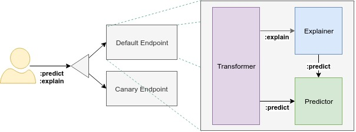

# Minio

A lot of the examples here use S3/GCS storage backend. If you want to use locally, you can create your default deployment for Minio in this cluster

kubectl create -f https://github.com/minio/minio/blob/master/docs/orchestration/kubernetes/minio-standalone-pvc.yaml?raw=true
persistentvolumeclaim "minio-pv-claim" created

KFServing architecture consists of two main specifications, around control plane and data plane. Control plane is responsible for deploying and managing the lifecycle of models, while data plane is responsible for defining the contracts to interact with models once deployed.

 * [KFserving control plane specification](control-plane.md)
   * Defines the specification of the `kfserving` resource.
 * [KFserving data plane specification](data-plane.md)
   * Defines the data payloads to enable interoperability between `kfserving` components.

# Architecture Overview
The KFService Data Plane architecture consists of a static graph of components which implement a limited set of features. Advanced features such as Ensembling, A/B testing, and Multi-Arm-Bandits should be built at a layer above KFServices. The diagram reflects the overall architecture for a viable offering, but at this point in time may not accurately reflect the current set of features available in the graph, but the overall mechanism holds:

- The User defines the components they wish to use in a KFService.
  - The only required component is a Predictor.
  - Additional components may be specified to attach addtional behavior. 
  - Each component is specified at the ModelSpec layer, allowing for canarying.
- The KFService will support one of several Data Plane interfaces.
  - For example: tensorflow/HTTP, tensorflow/GRPC, seldon/HTTP, seldon/GRPC
  - Data Plane interfaces may be specified with annotations and defaults to tensorflow/HTTP
  - Not all components will be compatible with every data plane interface.
- The Orchestrator wires up the components.
  - If the Predictor is the only component, the orchestrator will not be deployed.
  - The Orchestrator will orchestrate requests against the existing components.
- The Orchestrator will return a final response once the results have been aggregated.
  - Some components (e.g. payload logging) will execute asyncronously.

