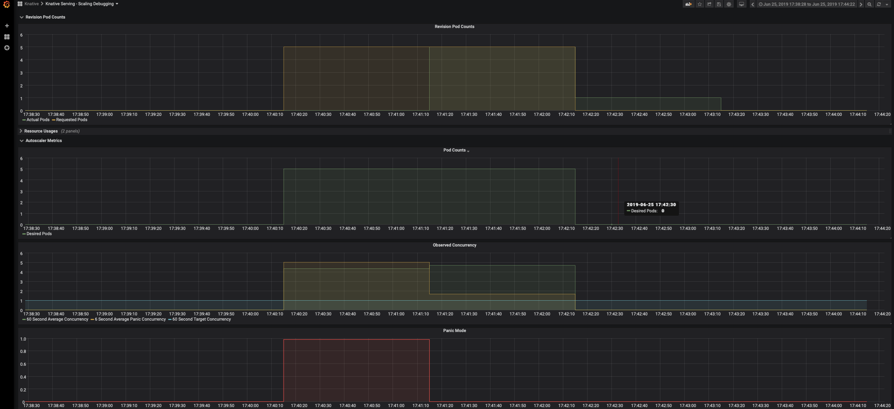

<!-- START doctoc generated TOC please keep comment here to allow auto update -->
<!-- DON'T EDIT THIS SECTION, INSTEAD RE-RUN doctoc TO UPDATE -->
**Table of Contents**  *generated with [DocToc](https://github.com/thlorenz/doctoc)*

- [Autoscale InferenceService with your inference workload](#autoscale-inferenceservice-with-your-inference-workload)
  - [Setup](#setup)
  - [Load your InferenceService with target concurrency](#load-your-inferenceservice-with-target-concurrency)
    - [Create the InferenceService](#create-the-inferenceservice)
    - [Load InferenceService with concurrent requests](#load-inferenceservice-with-concurrent-requests)
    - [Check Dashboard](#check-dashboard)
  - [Load your InferenceService with target QPS](#load-your-inferenceservice-with-target-qps)
    - [Create the InferenceService](#create-the-inferenceservice-1)
    - [Load InferenceService with target QPS](#load-inferenceservice-with-target-qps)
    - [Check Dashboard](#check-dashboard-1)
  - [Autoscaling on GPU!](#autoscaling-on-gpu)
    - [Create the InferenceService with GPU resource](#create-the-inferenceservice-with-gpu-resource)
    - [Load InferenceService with concurrent requests](#load-inferenceservice-with-concurrent-requests-1)
  - [Autoscaling Customization](#autoscaling-customization)

<!-- END doctoc generated TOC please keep comment here to allow auto update -->


# Autoscale InferenceService with your inference workload
## Setup
1. Your ~/.kube/config should point to a cluster with [KFServing installed](https://github.com/kubeflow/kfserving/#install-kfserving).
2. Your cluster's Istio Ingress gateway must be [network accessible](https://istio.io/latest/docs/tasks/traffic-management/ingress/ingress-control/).
3. [Metrics installation](https://knative.dev/docs/serving/installing-logging-metrics-traces) for viewing scaling graphs (optional).
4. The [hey](https://github.com/rakyll/hey) load generator installed (go get -u github.com/rakyll/hey).

## Load your InferenceService with target concurrency

### Create the InferenceService
Apply the tensorflow example CR with scaling target set to 1. Annotation `autoscaling.knative.dev/target` is the soft limit rather than a strictly
enforced limit, if there is sudden burst of the requests, this value can be exceeded.

```yaml
apiVersion: "serving.kserve.io/v1beta1"
kind: "InferenceService"
metadata:
  name: "flowers-sample"
  annotations:
    autoscaling.knative.dev/target: "1"
spec:
  predictor:
    tensorflow:
      storageUri: "gs://kfserving-examples/models/tensorflow/flowers"
```

```
kubectl apply -f autoscale.yaml
```

Expected Output
```
$ inferenceservice.serving.kserve.io/flowers-sample configured
```

### Load InferenceService with concurrent requests
The first step is to [determine the ingress IP and ports](../../../README.md#determine-the-ingress-ip-and-ports) and set `INGRESS_HOST` and `INGRESS_PORT`

Send traffic in 30 seconds spurts maintaining 5 in-flight requests.
```
MODEL_NAME=flowers-sample
INPUT_PATH=../tensorflow/input.json
HOST=$(kubectl get inferenceservice $MODEL_NAME -o jsonpath='{.status.url}' | cut -d "/" -f 3)
hey -z 30s -c 5 -m POST -host ${HOST} -D $INPUT_PATH http://${INGRESS_HOST}:${INGRESS_PORT}/v1/models/$MODEL_NAME:predict
```
Expected Output
```shell
Summary:
  Total:	30.0193 secs
  Slowest:	10.1458 secs
  Fastest:	0.0127 secs
  Average:	0.0364 secs
  Requests/sec:	137.4449
  
  Total data:	1019122 bytes
  Size/request:	247 bytes

Response time histogram:
  0.013 [1]	|
  1.026 [4120]	|■■■■■■■■■■■■■■■■■■■■■■■■■■■■■■■■■■■■■■■■
  2.039 [0]	|
  3.053 [0]	|
  4.066 [0]	|
  5.079 [0]	|
  6.093 [0]	|
  7.106 [0]	|
  8.119 [0]	|
  9.133 [0]	|
  10.146 [5]	|


Latency distribution:
  10% in 0.0178 secs
  25% in 0.0188 secs
  50% in 0.0199 secs
  75% in 0.0210 secs
  90% in 0.0231 secs
  95% in 0.0328 secs
  99% in 0.1501 secs

Details (average, fastest, slowest):
  DNS+dialup:	0.0002 secs, 0.0127 secs, 10.1458 secs
  DNS-lookup:	0.0002 secs, 0.0000 secs, 0.1502 secs
  req write:	0.0000 secs, 0.0000 secs, 0.0020 secs
  resp wait:	0.0360 secs, 0.0125 secs, 9.9791 secs
  resp read:	0.0001 secs, 0.0000 secs, 0.0021 secs

Status code distribution:
  [200]	4126 responses
```
Check the number of running pods now, `KFServing` uses `Knative Serving` autoscaler which is based on the
average number of in-flight requests per pod(concurrency). As the scaling target is set to 1 and we
load the service with 5 concurrent requests, so the autoscaler tries scaling up to 5 pods. Notice that out of all the requests there are 
5 requests on the histogram that take around 10s, that's the cold start time cost to initially spawn the pods and download model to be ready
to serve. The cold start may take longer(to pull the serving image) if the image is not cached on the node that the pod is scheduled on.
```
$ kubectl get pods
NAME                                                       READY   STATUS            RESTARTS   AGE
flowers-sample-default-7kqt6-deployment-75d577dcdb-sr5wd         3/3     Running       0          42s
flowers-sample-default-7kqt6-deployment-75d577dcdb-swnk5         3/3     Running       0          62s
flowers-sample-default-7kqt6-deployment-75d577dcdb-t2njf         3/3     Running       0          62s
flowers-sample-default-7kqt6-deployment-75d577dcdb-vdlp9         3/3     Running       0          64s
flowers-sample-default-7kqt6-deployment-75d577dcdb-vm58d         3/3     Running       0          42s
```

### Check Dashboard
View the Knative Serving Scaling dashboards (if configured).

```bash
kubectl port-forward --namespace knative-monitoring $(kubectl get pods --namespace knative-monitoring --selector=app=grafana  --output=jsonpath="{.items..metadata.name}") 3000
```




## Load your InferenceService with target QPS

### Create the InferenceService
Apply the tensorflow example CR
```
kubectl apply -f autoscale.yaml
```

Expected Output
```
$ inferenceservice.serving.kserve.io/flowers-sample configured
```

### Load InferenceService with target QPS
The first step is to [determine the ingress IP and ports](../../../README.md#determine-the-ingress-ip-and-ports) and set `INGRESS_HOST` and `INGRESS_PORT`

Send 30 seconds of traffic maintaining 50 qps.
```bash
MODEL_NAME=flowers-sample
INPUT_PATH=../tensorflow/input.json
HOST=$(kubectl get inferenceservice $MODEL_NAME -o jsonpath='{.status.url}' | cut -d "/" -f 3)
hey -z 30s -q 50 -m POST -host ${HOST} -D $INPUT_PATH http://${INGRESS_HOST}:${INGRESS_PORT}/v1/models/$MODEL_NAME:predict
```

```shell
Summary:
  Total:	30.0264 secs
  Slowest:	10.8113 secs
  Fastest:	0.0145 secs
  Average:	0.0731 secs
  Requests/sec:	683.5644
  
  Total data:	5069675 bytes
  Size/request:	247 bytes

Response time histogram:
  0.014 [1]	|
  1.094 [20474]	|■■■■■■■■■■■■■■■■■■■■■■■■■■■■■■■■■■■■■■■■
  2.174 [0]	|
  3.254 [0]	|
  4.333 [0]	|
  5.413 [0]	|
  6.493 [0]	|
  7.572 [0]	|
  8.652 [0]	|
  9.732 [0]	|
  10.811 [50]	|


Latency distribution:
  10% in 0.0284 secs
  25% in 0.0334 secs
  50% in 0.0408 secs
  75% in 0.0527 secs
  90% in 0.0765 secs
  95% in 0.0949 secs
  99% in 0.1334 secs

Details (average, fastest, slowest):
  DNS+dialup:	0.0001 secs, 0.0145 secs, 10.8113 secs
  DNS-lookup:	0.0000 secs, 0.0000 secs, 0.0196 secs
  req write:	0.0000 secs, 0.0000 secs, 0.0031 secs
  resp wait:	0.0728 secs, 0.0144 secs, 10.7688 secs
  resp read:	0.0000 secs, 0.0000 secs, 0.0031 secs

Status code distribution:
  [200]	20525 responses
```

Check the number of running pods now, we are loading the service with 50 requests per second, and from the dashboard you can see
that it hits the average concurrency 10 and autoscaler tries scaling up to 10 pods.

### Check Dashboard
View the Knative Serving Scaling dashboards (if configured).

```bash
kubectl port-forward --namespace knative-monitoring $(kubectl get pods --namespace knative-monitoring --selector=app=grafana  --output=jsonpath="{.items..metadata.name}") 3000
```


Autoscaler calculates average concurrency over 60 second window so it takes a minute to stabilize at the desired concurrency level,
however it also calculates the 6 second panic window and will enter into [panic mode](https://github.com/knative/serving/blob/master/docs/scaling/DEVELOPMENT.md#panic-mode) if that window reaches 2x target concurrency.
From the dashboard you can see that it enters panic mode in which autoscaler operates on shorter and more sensitive window. Once the panic
conditions are no longer met for 60 seconds, autoscaler will return back to 60 seconds stable window.

## Autoscaling on GPU!
Autoscaling on GPU is hard with GPU metrics, however thanks to Knative's concurrency based autoscaler scaling on GPU
is pretty easy and effective!

### Create the InferenceService with GPU resource
Apply the tensorflow gpu example CR
```
apiVersion: "serving.kserve.io/v1beta1"
kind: "InferenceService"
metadata:
  name: "flowers-sample-gpu"
spec:
  predictor:
    tensorflow:
      storageUri: "gs://kfserving-examples/models/tensorflow/flowers"
      runtimeVersion: "1.14.0-gpu"
      resources:
        limits:
          nvidia.com/gpu: 1
```

```
kubectl apply -f autoscale_gpu.yaml
```

### Load InferenceService with concurrent requests
The first step is to [determine the ingress IP and ports](../../../README.md#determine-the-ingress-ip-and-ports) and set `INGRESS_HOST` and `INGRESS_PORT`

Send 30 seconds of traffic maintaining 5 in-flight requests.
```
MODEL_NAME=flowers-sample-gpu
INPUT_PATH=../tensorflow/input.json
HOST=$(kubectl get inferenceservice $MODEL_NAME -o jsonpath='{.status.url}' | cut -d "/" -f 3)
hey -z 30s -c 5 -m POST -host ${HOST} -D $INPUT_PATH http://${INGRESS_HOST}:${INGRESS_PORT}/v1/models/$MODEL_NAME:predict
```
Expected output
```shell
Summary:
  Total:	30.0152 secs
  Slowest:	9.7581 secs
  Fastest:	0.0142 secs
  Average:	0.0350 secs
  Requests/sec:	142.9942
  
  Total data:	948532 bytes
  Size/request:	221 bytes

Response time histogram:
  0.014 [1]	|
  0.989 [4286]	|■■■■■■■■■■■■■■■■■■■■■■■■■■■■■■■■■■■■■■■■
  1.963 [0]	|
  2.937 [0]	|
  3.912 [0]	|
  4.886 [0]	|
  5.861 [0]	|
  6.835 [0]	|
  7.809 [0]	|
  8.784 [0]	|
  9.758 [5]	|


Latency distribution:
  10% in 0.0181 secs
  25% in 0.0189 secs
  50% in 0.0198 secs
  75% in 0.0210 secs
  90% in 0.0230 secs
  95% in 0.0276 secs
  99% in 0.0511 secs

Details (average, fastest, slowest):
  DNS+dialup:	0.0000 secs, 0.0142 secs, 9.7581 secs
  DNS-lookup:	0.0000 secs, 0.0000 secs, 0.0291 secs
  req write:	0.0000 secs, 0.0000 secs, 0.0023 secs
  resp wait:	0.0348 secs, 0.0141 secs, 9.7158 secs
  resp read:	0.0001 secs, 0.0000 secs, 0.0021 secs

Status code distribution:
  [200]	4292 responses
```
## Autoscaling Customization

### Autoscaling with ContainerConcurrency
`ContainerConcurrency` determines the number of simultaneous requests that can be processed by each replica of the `InferenceService`
at any given time, it is a hard limit and if the concurrency reaches the hard limit surplus requests will be buffered and must wait until
enough capacity is free to execute the requests.

```yaml
apiVersion: "serving.kserve.io/v1beta1"
kind: "InferenceService"
metadata:
  name: "flowers-sample"
spec:
  predictor:
    containerConcurrency: 10
    tensorflow:
      storageUri: "gs://kfserving-examples/models/tensorflow/flowers"
```

```bash
kubectl apply -f autoscale_custom.yaml
```

### Enable scale down to zero
KFServing by default sets `minReplicas` to 1, if you want to enable scaling down to zero especially for use cases like serving on GPUs you can
set `minReplicas` to 0 so that the pods automatically scale down to zero when no traffic is received.

```yaml
apiVersion: "serving.kserve.io/v1beta1"
kind: "InferenceService"
metadata:
  name: "flowers-sample"
spec:
  predictor:
    minReplicas: 0
    tensorflow:
      storageUri: "gs://kfserving-examples/models/tensorflow/flowers"
```
