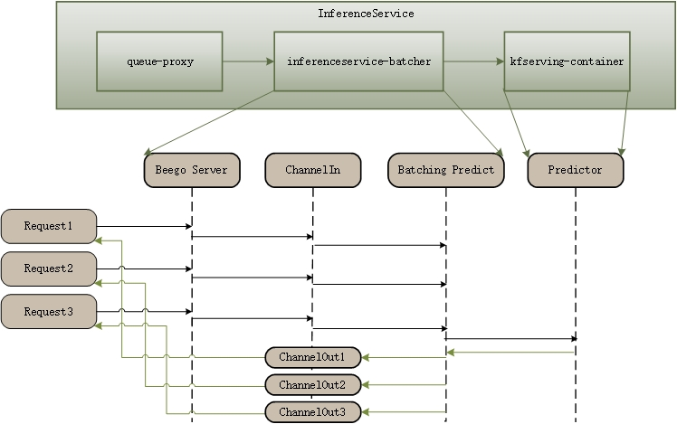

# Inference Batcher

We add this module to support batch prediction for any ML frameworks (TensorFlow, PyTorch, ...) without decreasing the performance.

This batcher is implemented in the KServe model agent sidecar, so the requests first hit the agent sidecar, when a batch prediction is triggered
the request is then sent to the model server container for inference.



* We use webhook to inject the model agent container in the InferenceService pod to do the batching when batcher is enabled. 
* We use go channels to transfer data between http requset handler and batcher go routines.
* Currently we only implemented batching with KServe v1 HTTP protocol, gRPC is not supported yet.
* When the number of instances (For example, the number of pictures) reaches the `maxBatchSize` or the latency meets the `maxLatency`, a batch prediction will be triggered.
```
apiVersion: "serving.kserve.io/v1beta1"
kind: "InferenceService"
metadata:
  name: "pytorch-cifar10"
spec:
  predictor:
    timeout: 60
    minReplicas: 1
    batcher:
      maxBatchSize: 32
      maxLatency: 5000
    pytorch:
      storageUri: "gs://kfserving-examples/models/torchserve/image-classifier"
```
* `maxBatchSize`: the max batch size for triggering a prediction.
* `maxLatency`: the max latency for triggering a prediction (In milliseconds).
* `timeout`: timeout of calling predictor service (In seconds).

All of the bellowing fields have default values in the code. You can config them or not as you wish.
* `maxBatchSize`: 32.
* `maxLatency`: 5000.
* `timeout`: 60.
