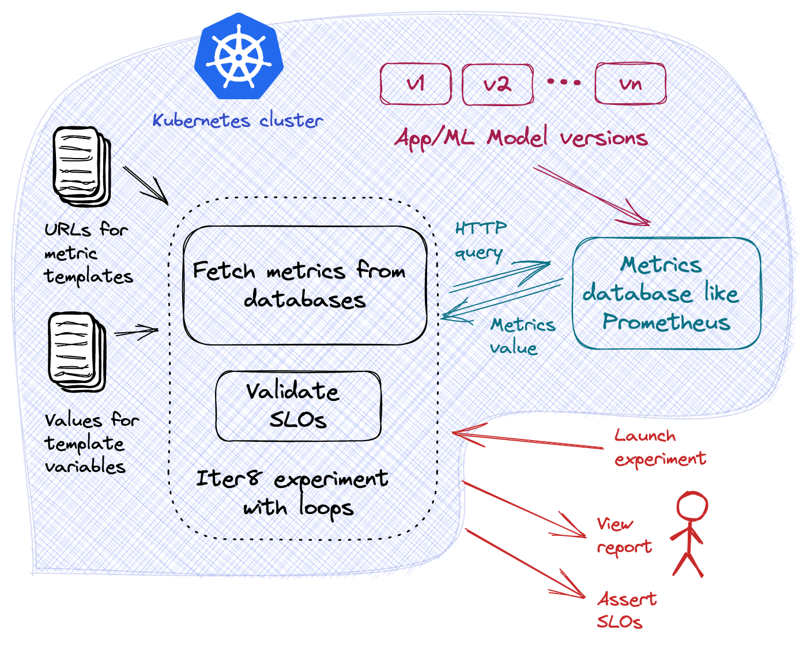
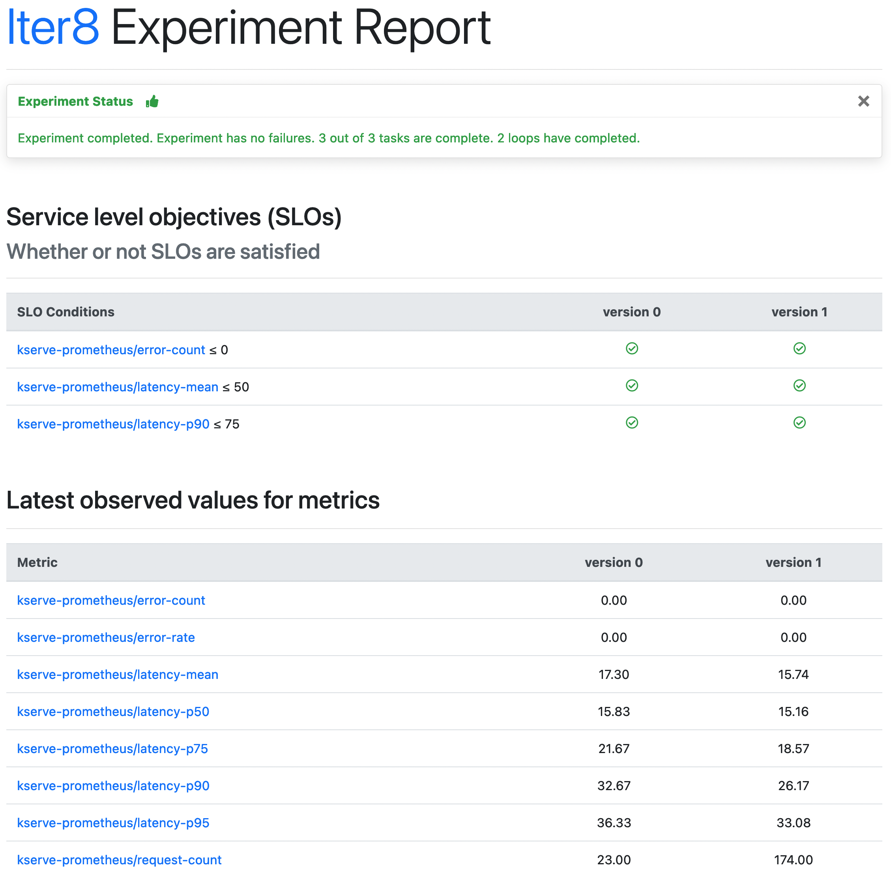

# Canary testing

This tutorial demonstrates canary testing for KServe inference services using model metrics written to Prometheus. We will use [Iter8](https://iter8.tools) to read the metrics from Prometheus and validate service-level objectives (SLOs) for two model versions. [Iter8](https://iter8.tools) is an open-source Kubernetes release optimizer that makes it easy to ensure that your ML models perform well and maximize business value.



***

> Performance (load) testing of KServe inference services is described [here](../performance-testing/README.md). This tutorial focuses on canary testing using Prometheus metrics. The main steps in this tutorial are:
> 1. [Deploy an InferenceService](#deploy-an-inferenceservice)
> 2. [Deploy canary version](#deploy-canary-version)
> 3. [Launch an Iter8 experiment](#launch-an-iter8-experiment)
> 4. [View experiment report](#view-experiment-report)

## Install Prometheus

Install Prometheus monitoring for KServe [using these instructions](https://github.com/kserve/kserve/tree/master/docs/samples/metrics-and-monitoring#install-prometheus).

## Deploy an InferenceService

Create an InferenceService.

```shell
kubectl apply -f - <<EOF
apiVersion: "serving.kserve.io/v1beta1"
kind: "InferenceService"
metadata:
  name: "sklearn-iris"
spec:
  predictor:
    model:
      modelFormat:
        name: sklearn
      storageUri: "gs://kfserving-examples/models/sklearn/1.0/model"
EOF
```

## Deploy canary version

Update the inference service with a canary model, configured to receive 10% of prediction requests.

```shell
kubectl apply -f - <<EOF
apiVersion: "serving.kserve.io/v1beta1"
kind: "InferenceService"
metadata:
  name: "sklearn-iris"
spec:
  predictor:
    canaryTrafficPercent: 10
    model:
      modelFormat:
        name: sklearn
      storageUri: "gs://kfserving-examples/models/sklearn/1.0/model-2"
EOF
```

Verify that your inference service is ready.

```shell
kubectl wait --for=condition=Ready --timeout=600s isvc/sklearn-iris
```

## Install Iter8 CLI
Install the Iter8 CLI using `brew` as follows. You can also install using pre-built binaries as described [here](https://iter8.tools/0.13/getting-started/install/).

```shell
brew tap iter8-tools/iter8
brew install iter8@0.13
```

## Simulate users

In a production cluster, there would be no need to simulate users as there would be real users. For the purposes of this tutorial, simulate users using [the port forward approach](https://kserve.github.io/website/master/get_started/first_isvc/#4-determine-the-ingress-ip-and-ports).

```shell
INGRESS_GATEWAY_SERVICE=$(kubectl get svc --namespace istio-system --selector="app=istio-ingressgateway" --output jsonpath='{.items[0].metadata.name}')
kubectl port-forward --namespace istio-system svc/${INGRESS_GATEWAY_SERVICE} 8080:80
```

In a separate terminal, run the following command.
```shell
while true; do
  curl -H 'Host: sklearn-iris.default.example.com' \
  http://localhost:8080/v1/models/sklearn-iris:predict \
  -d '{"instances": [[6.8,  2.8,  4.8,  1.4], [6.0,  3.4,  4.5,  1.6]]}';
  echo "";
  sleep 1
done
```

## Launch an Iter8 experiment
Iter8 introduces the notion of an *experiment* that makes it easy to verify that your inference service is ready, fetch metrics for the stable and canary versions of your ML model from Prometheus, and assess service-level objectives (SLOs). Launch the Iter8 experiment inside the Kubernetes cluster.

```shell
ISVC="sklearn-iris"
CURRENT_REVISION=$(kubectl get isvc ${ISVC} -o jsonpath='{.status.components.predictor.latestRolledoutRevision}')
CANARY_REVISION=$(kubectl get isvc ${ISVC} -o jsonpath='{.status.components.predictor.latestCreatedRevision}')
```

```shell
iter8 k launch \
--set "tasks={ready,custommetrics,assess}" \
--set ready.isvc=${ISVC} \
--set ready.timeout=600s \
--set custommetrics.templates.kserve-prometheus="https://gist.githubusercontent.com/kalantar/adc6c9b0efe483c00b8f0c20605ac36c/raw/fc0696233aa766ec4ba1d82c206c1b78f8f1f267/kserve-prometheus.tpl" \
--set custommetrics.values.labels.service_name=${ISVC}-predictor-default \
--set "custommetrics.versionValues[0].labels.revision_name=${CURRENT_REVISION}" \
--set "custommetrics.versionValues[1].labels.revision_name=${CANARY_REVISION}" \
--set "custommetrics.values.latencyPercentiles={50,75,90,95}" \
--set assess.SLOs.upper.kserve-prometheus/latency-mean=50 \
--set assess.SLOs.upper.kserve-prometheus/latency-p90=75 \
--set assess.SLOs.upper.kserve-prometheus/error-count=0 \
--set runner=cronjob \
--set cronjobSchedule="*/1 * * * *"
```

### More about this Iter8 experiment

1. This experiment consists of three tasks, namely, [ready](https://iter8.tools/0.13/user-guide/tasks/ready), [custommetrics](https://iter8.tools/0.13/user-guide/tasks/custommetrics), and [assess](https://iter8.tools/0.13/user-guide/tasks/assess).

    * The [ready](https://iter8.tools/0.13/user-guide/tasks/ready) task checks if the `sklearn-iris` inference service exists and is ready to serve user requests.

    * The [custommetrics](https://iter8.tools/0.13/user-guide/tasks/custommetrics) task collect errors and response time metrics from Prometheus.

    * The [assess](https://iter8.tools/0.13/user-guide/tasks/assess) task verifies if the app satisfies the specified SLOs: i) the mean latency of the service does not exceed 50 msec, ii) the 90th percentile latency of the service does not exceed 75 msec, and iii) there are no errors (4xx or 5xx response codes) in the responses.

2. This is a multi-loop experiment where all the previously mentioned tasks will run repeatedly per the `cronjobSchedule` (once per minute).

## View experiment report
```shell
iter8 k report -o html > report.html # view in a browser
```

Below is a sample HTML report.



You can also [assert various conditions](https://iter8.tools/0.13/getting-started/your-first-experiment/#assert-experiment-outcomes) about the outcome of the experiment and [view the execution logs](https://iter8.tools/0.13/getting-started/your-first-experiment/#view-experiment-logs) for the experiment.

## Cleanup
Delete the Iter8 experiment and KServe inference service.

```shell
iter8 k delete
kubectl delete isvc sklearn-iris
```

***

This tutorial just scratches the surface of Iter8 experimentation capabilities. For more features (for example, automatically sending [a notification](https://iter8.tools/0.13/user-guide/tasks/slack/#if-parameter) to slack or GitHub with experiment results), please see [Iter8 documentation](https://iter8.tools).
