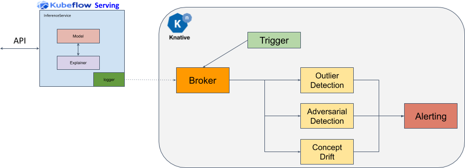

# CIFAR10 Drift Detector

A [CIFAR10](https://www.cs.toronto.edu/~kriz/cifar.html) Drift Detector. Run the [notebook demo](cifar10_drift.ipynb) to test.

The notebook requires KNative Eventing >= 0.18.

The architecture used is shown below and links the payload logging available within KFServing with asynchronous processing of those payloads in KNative eventing to detect drift.

