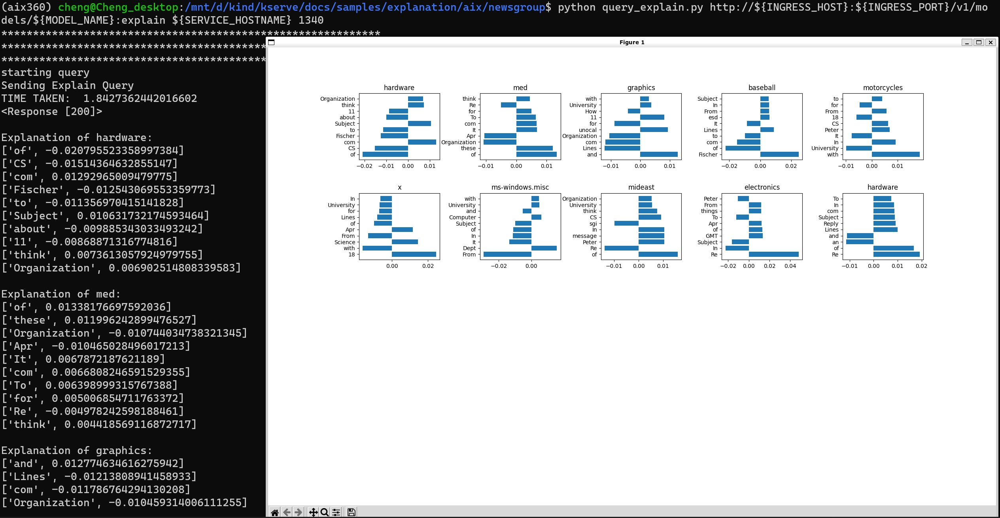

# Using AIX to get explanations for NewsGroups classifications

This is another explanation example for text compare to [MNIST classifications (for image)](https://github.com/kserve/kserve/tree/master/docs/samples/explanation/aix/mnist).

To deploy the inferenceservice with v1beta1 API

`kubectl apply -f aix-explainer.yaml`

Then find the url.

`kubectl get inferenceservice aix-explainer`

```
NAME            URL                                        READY   PREV   LATEST   PREVROLLEDOUTREVISION   LATESTREADYREVISION                     AGE
aix-explainer   http://aix-explainer.default.example.com   True           100                              aix-explainer-predictor-default-00001   10m

```

## Explanation
The first step is to [determine the ingress IP and ports](../../../../../README.md#determine-the-ingress-ip-and-ports) and set `INGRESS_HOST` and `INGRESS_PORT`

```
MODEL_NAME=aix-explainer
SERVICE_HOSTNAME=$(kubectl get inferenceservice ${MODEL_NAME} -o jsonpath='{.status.url}' | cut -d "/" -f 3)
python query_explain.py http://${INGRESS_HOST}:${INGRESS_PORT}/v1/models/${MODEL_NAME}:explain ${SERVICE_HOSTNAME}
```

Then you will see the explanation result as several charts.



Each chart title represents a class name (newsgroup). In this case, it has 20 different newsgroups related to computer, science, humanities, etc. Y-axis represents words that will make the article to be classfied to this newsgroup. X-axis indicates the magnitude.

## Stopping the Inference Service

`kubectl delete -f aix-explainer.yaml`

## Build a Development AIX Model Explainer Docker Image

If you would like to build a development image for the AIX Model Explainer then follow [these instructions](https://github.com/kserve/kserve/tree/release-0.10/python/aixexplainer#build-a-development-aix-model-explainer-docker-image)

