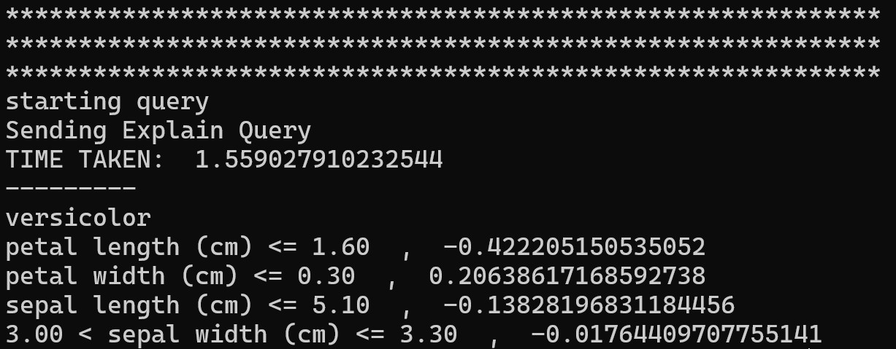

# Using AIX to get explanations for Iris classifications

To deploy the inferenceservice with v1beta1 API

`kubectl apply -f aix-explainer.yaml`

Then find the url.

`kubectl get inferenceservice aix-explainer`

```
NAME            URL                                        READY   PREV   LATEST  PREVROLLEDOUTREVISION  LATESTREADYREVISION                     AGE
aix-explainer   http://aix-explainer.default.example.com   True           100                            aix-explainer-predictor-default-00001   2m58s
```

## Explanation
The first step is to [determine the ingress IP and ports](../../../../../README.md#determine-the-ingress-ip-and-ports) and set `INGRESS_HOST` and `INGRESS_PORT`

```
MODEL_NAME=aix-explainer
SERVICE_HOSTNAME=$(kubectl get inferenceservice ${MODEL_NAME} -o jsonpath='{.status.url}' | cut -d "/" -f 3)
python query_explain.py http://${INGRESS_HOST}:${INGRESS_PORT}/v1/models/${MODEL_NAME}:explain ${SERVICE_HOSTNAME}
```

Then you will see the explanation shown below.



The result shows the predicted class and the features with different weights that led the predictor to make this prediction. In this case, the predicted class is versicolor, the petal length, petal width, and sepal length are features. The explanation is the numbers following each feature, and it means the relative probability of the sample belonging to the predicted class.

## Stopping the Inference Service

`kubectl delete -f aix-explainer.yaml`

## Build a Development AIX Model Explainer Docker Image

If you would like to build a development image for the AIX Model Explainer then follow [these instructions](/python/aixexplainer#build-a-development-aix-model-explainer-docker-image)

