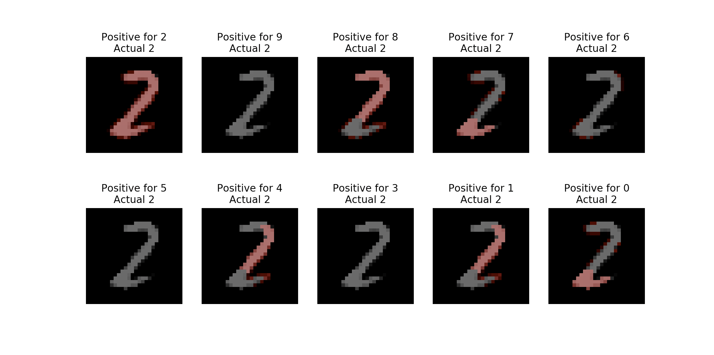

# Using AIX to get explanations for MNIST classifications

This is an example of how to explain model predictions using [AI Explainability 360 (AIX360)](https://ai-explainability-360.org/) on KFServing. We will be using mnist dataset for handwritten digits for this model and explain how the model decides the predicted results.

To deploy the inferenceservice with v1beta1 API

`kubectl apply -f aix-explainer.yaml`

Then find the url.

`kubectl get inferenceservice`

```
NAME         URL                                               READY   DEFAULT TRAFFIC   CANARY TRAFFIC   AGE
aixserver   http://aixserver.somecluster/v1/models/aixserver   True    100                                40m
```

## Explanation
The first step is to [determine the ingress IP and ports](../../../../../README.md#determine-the-ingress-ip-and-ports) and set `INGRESS_HOST` and `INGRESS_PORT`

```
MODEL_NAME=aix-explainer
SERVICE_HOSTNAME=$(kubectl get inferenceservice ${MODEL_NAME} -o jsonpath='{.status.url}' | cut -d "/" -f 3)
python query_explain.py http://${INGRESS_HOST}:${INGRESS_PORT}/v1/models/${MODEL_NAME}:explain ${SERVICE_HOSTNAME}
```

After a bit of time you should see a pop up containing the explanation, similar to the image below. The LIME method used in this example highlights the pixels in red that score above a certain confidence value for indicating a classification. The explanation shown will contain a collection of images that are highlighted paired with a title to describe the context. For each title and image pair, the title will say `Positive for <X> Actual <Y>` to denote that <X> is the classification that LIME is testing for and <Y> is the correct label for that image.
  


To give an example, the top-left image with the title "Positive for 2 Actual 2" is the image with pixels highlighted that score above a specified confidence level for indicating a classification of 2 (where 2 is also the correct classification). 

Similarly, the bottom-right image with the title "Positive for 0 Actual 2" is the image with pixels highlighted that score above a specified confidence level for indicating a classification of 0 (where 2 is the correct classification). If the model were to incorrectly classify the image as 0, then you could get an explanation of why by looking at the highlighted pixels as being especially troublesome. By raising and lowering the min_weight parameter in the deployment yaml you can test to see which pixels your model believes are the most and least relevant for each classification.

To try a different MNIST example add an integer to the end of the query between 0-10,000. The integer chosen will be the index of the image to be chosen in the MNIST dataset.

```
python query_explain.py http://${INGRESS_HOST}:${INGRESS_PORT}/v1/models/${MODEL_NAME}:explain ${SERVICE_HOSTNAME} 100
```
To try different parameters with explainer, add another string json argument to specify the parameters. Supported modified parameters: top_labels, segmentation_alg, num_samples, positive_only, and min_weight. 

```
python query_explain.py http://${INGRESS_HOST}:${INGRESS_PORT}/v1/models/${MODEL_NAME}:explain ${SERVICE_HOSTNAME} 100 '{"top_labels":"10"}'

```

## Stopping the Inference Service

`kubectl delete -f aix-explainer.yaml`

## Build a Development AIX Model Explainer Docker Image

If you would like to build a development image for the AIX Model Explainer then follow [these instructions](/python/aixexplainer#build-a-development-aix-model-explainer-docker-image)

## Troubleshooting

`<504> Gateway Timeout <504>` - the explainer is probably taking too long and not sending a response back quickly enough. Either there aren't enough resources allocated or the number of samples the explainer is allowed to take needs to be reduced. To fix this go to aix-explainer.yaml and increase resources. Or to lower the number of allowed samples go to aix-explainer.yaml and add a flag to `explainer: command:` '--num_samples' (the default number of samples is 1000)

If you see `Configuration "aixserver-explainer-default" does not have any ready Revision` the container may have taken too long to download. If you run `kubectl get revision` and see your revision is stuck in `ContainerCreating` try deleting the inferenceservice and redeploying.
