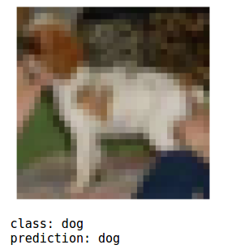
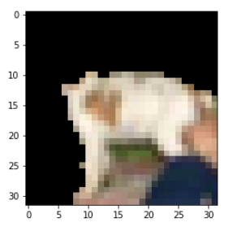

# CIFAR10 Image Classifier Explanations

We will use a Tensorflow classifier built on [CIFAR10 image dataset](https://www.cs.toronto.edu/~kriz/cifar.html) which is a 10 class image dataset.

The KFServing resource describes:
   * A pretrained tensorflow model stored on a Google bucket
   * Am AnchorImage [Seldon Alibi](https://github.com/SeldonIO/alibi) Explainer. See the [Alibi Docs](https://docs.seldon.io/projects/alibi/en/stable/) for further details.

Run this example using the [Jupyter notebook](cifar10_explanations.ipynb).

Once created you will be able to test the predictions:

And then get an explanation for it:

