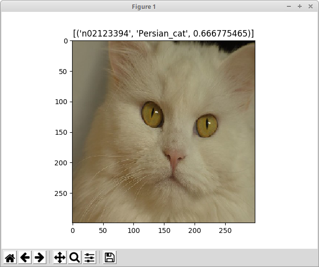
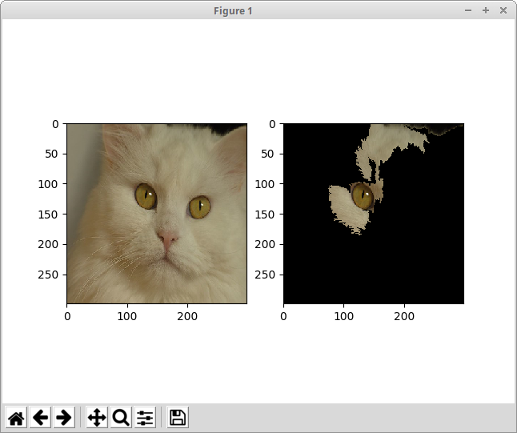

# Example Anchors Image Explanation for Imagenet

For users of KFServing v0.3.0 please follow [the README for v0.3.0 branch](https://github.com/kubeflow/kfserving/tree/v0.3.0/docs/samples/explanation/alibi/imagenet).

We can create a InferenceService with a trained Tensorflow Imagenet predictor for this dataset and an associated explainer. The black box explainer algorithm we will use is the Images version of Anchors from the [Alibi open source library](https://github.com/SeldonIO/alibi). More details on this algorithm and configuration settings that can be set can be found in the [Seldon Alibi documentation](https://docs.seldon.io/projects/alibi/en/stable/).

The InferenceService is shown below:

```
apiVersion: "serving.kubeflow.org/v1alpha2"
kind: "InferenceService"
metadata:
  name: "imagenet"
spec:
  default:
    predictor:
      tensorflow:
        storageUri: "gs://seldon-models/tfserving/imagenet/model"
        resources:
          requests:
            cpu: 0.1
            memory: 5Gi                        
          limits:
            memory: 10Gi
    explainer:
      alibi:
        type: AnchorImages
        storageUri: "gs://seldon-models/tfserving/imagenet/alibi/0.4.0"
        config:
          batch_size: "25"
	  stop_in_first: "True"
        resources:
          requests:
            cpu: 0.1
            memory: 5Gi            
          limits:
            memory: 10Gi
        
```

We set a custom config for batch_size as presently image requests are slow and may cause gateway timeouts if the batch size is too large and we ask to stop on first satisfactory anchor. See the [Alibi API documentation](https://docs.seldon.io/projects/alibi/en/latest/api/alibi.explainers.anchor_image.html#alibi.explainers.anchor_image.AnchorImage.explain) for more details of the available options.

Create this InferenceService:

```
kubectl create -f imagenet.yaml
```

Set up some environment variables for the model name and cluster entrypoint.

```
INGRESS_GATEWAY=istio-ingressgateway
export CLUSTER_IP=$(kubectl -n istio-system get service $INGRESS_GATEWAY -o jsonpath='{.status.loadBalancer.ingress[0].ip}')
```

Test the predictor on an example image:

```
python test_imagenet.py
```

You should receive a pop up view of the image and its prediction (Warning this may take some time):



Now lets get an explanation for this input image.

```
python test_imagenet.py --op explain
```

You should see a popup with the original image and the segments most influential in the model making the prediction it did.




## Local Training

Install requirements

```
pip install -r requirements.txt
```

To train the explainer locally you can run

```
make train
```

