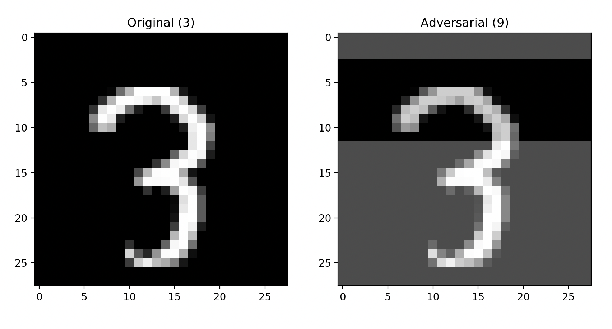

# Using ART to get adversarial examples for MNIST classifications

This is an example to show how adversarially modified inputs can trick models to predict incorrectly to highlight model vulnerability to adversarial attacks. It is using the [Adversarial Robustness Toolbox (ART)](https://adversarial-robustness-toolbox.org/) on KFServing. ART provides tools that enable developers to evaluate, defend, and verify ML models and applications against adversarial threats. Apart from giving capabilities to craft [adversarial attacks](https://github.com/Trusted-AI/adversarial-robustness-toolbox/wiki/ART-Attacks), it also provides [algorithms to defend](https://github.com/Trusted-AI/adversarial-robustness-toolbox/wiki/ART-Defences) against them.

We will be using the MNIST dataset which is a dataset of handwritten digits and find adversarial examples which will can make the model predict a classification incorrectly, thereby showing the vulnerability of the model against adversarial attacks.

To deploy the inferenceservice with v1beta1 API

`kubectl apply -f art.yaml`

Then find the url.

`kubectl get inferenceservice`

```
NAME         URL                                               READY   DEFAULT TRAFFIC   CANARY TRAFFIC   AGE
artserver   http://artserver.somecluster/v1/models/artserver   True    100                                40m
```

## Explanation
The first step is to [determine the ingress IP and ports](../../../../../README.md#determine-the-ingress-ip-and-ports) and set `INGRESS_HOST` and `INGRESS_PORT`

```
MODEL_NAME=artserver
SERVICE_HOSTNAME=$(kubectl get inferenceservice ${MODEL_NAME} -o jsonpath='{.status.url}' | cut -d "/" -f 3)
python query_explain.py http://${INGRESS_HOST}:${INGRESS_PORT}/v1/models/$MODEL_NAME:explain ${SERVICE_HOSTNAME}
```

After some time you should see a pop up containing the explanation, similar to the image below. If a pop up does not display and the message "Unable to find an adversarial example." appears then an adversarial example could not be found for the image given in a timely manner. If a pop up does display then the image on the left is the original image and the image on the right is the adversarial example. The labels above both images represent what classification the model made for each individual image.



The [Square Attack method](https://arxiv.org/abs/1912.00049) used in this example creates a random update at each iteration and adds this update to the adversarial input if it makes a misclassification more likely (more specifically, if it improves the objective function). Once enough random updates are added together and the model misclassifies then the resulting adversarial input will be returned and displayed.

To try a different MNIST example add an integer to the end of the query between 0-9,999. The integer chosen will be the index of the image to be chosen in the MNIST dataset. Or to try a file with custom data add the file path to the end. Keep in mind that the data format must be `{"instances": [<image>, <label>]}`

```
python query_explain.py http://${INGRESS_HOST}:${INGRESS_PORT}/v1/models/$MODEL_NAME:explain ${SERVICE_HOSTNAME} 100
python query_explain.py http://${INGRESS_HOST}:${INGRESS_PORT}/v1/models/$MODEL_NAME:explain ${SERVICE_HOSTNAME} ./input.json
```

## Stopping the Inference Service

`kubectl delete -f art.yaml`

## Build a Development ART Explainer Docker Image

If you would like to build a development image for the ART Explainer then follow [these instructions](/python/artexplainer#build-a-development-art-model-explainer-docker-image)

## Troubleshooting

`<504> Gateway Timeout <504>` - the explainer is probably taking too long and not sending a response back quickly enough. Either there aren't enough resources allocated or the number of samples the explainer is allowed to take needs to be reduced. To fix this go to art.yaml and increase resources.

If you see `Configuration "artserver-default" does not have any ready Revision` the container may have taken too long to download. If you run `kubectl get revision` and see your revision is stuck in `ContainerCreating` try deleting the inferenceservice and redeploying.
