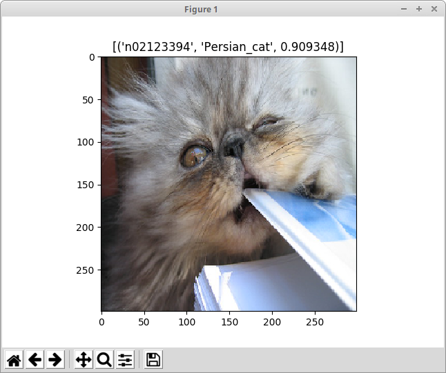
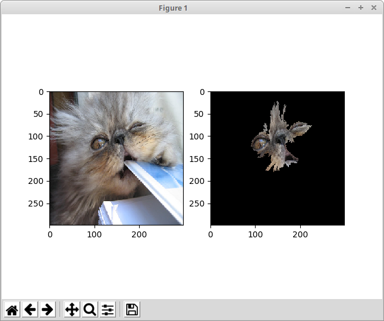

# Example Anchors Image Explaination for Imagenet

We can create a KFService with a trained Tensorflow Imagenet predictor for this dataset and an associated explainer:

```
apiVersion: "serving.kubeflow.org/v1alpha2"
kind: "KFService"
metadata:
  name: "imagenet"
spec:
  default:
    predictor:
      tensorflow:
        modelUri: "gs://seldon-models/tfserving/imagenet/model"
        resources:
          requests:
            cpu: 0.1
            memory: 5Gi                        
          limits:
            memory: 10Gi
    explainer:
      alibi:
        type: anchor_images
        storageUri: "gs://seldon-models/tfserving/imagenet/explainer"
        resources:
          requests:
            cpu: 0.1
            memory: 5Gi            
          limits:
            memory: 10Gi
```

Create this KfService:

```
kubectl create -f imagenet.yaml
```

Set up some environment variables for the model name and cluster entrypoint:

```
export CLUSTER_IP=$(kubectl -n istio-system get service istio-ingressgateway -o jsonpath='{.status.loadBalancer.ingress[0].ip}')
```

Test the predictor on an example sentence:

```
python test_imagenet.py
```

You should receive a pop up view of the image and its prediction:



Now lets get an explanation for this input image.

```
python test_imagenet.py --op explain
```

You should see a popup with the original image and the segments most influential in the model making the prediction it did.




## Local Training

Install requirements

```
pip install -r requirements.txt
```

To train the explainer locally you can run

```
make train
```

