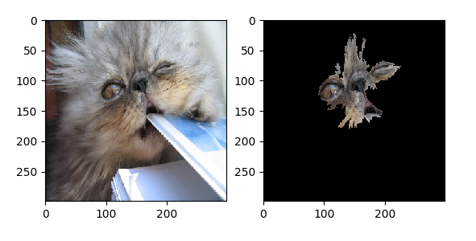

# Example Anchors Image Explaination for Imagenet

Train a model for income prediction.

**This example will run the explainer locally which for images will mean the test is quite slow. This will be updated to a full example soon**


Assuming you have KfServing installed. Launch a Tensorflow pretrained Imagenet model:

```
kubectl create -f imagenet.yaml
```

Train the explainer by running:

```
python train_explainer.py
```

To run the explainer locally:

```
MODEL_NAME=imagenet
CLUSTER_IP=$(kubectl -n istio-system get service istio-ingressgateway -o jsonpath='{.status.loadBalancer.ingress[0].ip}')
python -m alibiexplainer --explainer_name ${MODEL_NAME} --predict_url http://${CLUSTER_IP}/v1/models/${MODEL_NAME}:predict --protocol tensorflow.http --http_port 8081 --type anchor_images --storageUri ${PWD} --host_header ${MODEL_NAME}.default.svc.cluster.local
```

Now we can get an explanation for an Imagenet image by running:

```
python get_explanation.py
```

This show eventually show the image to be explained alongside the explanation.



