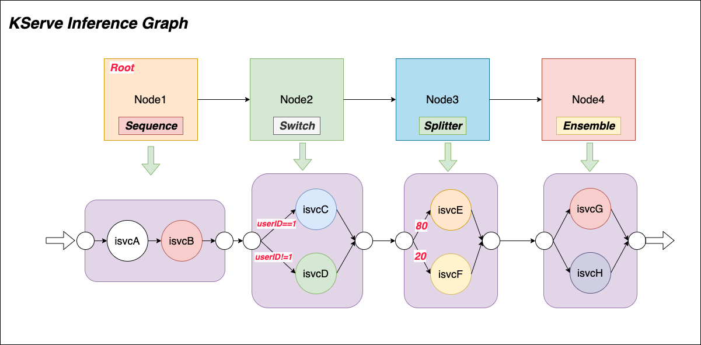
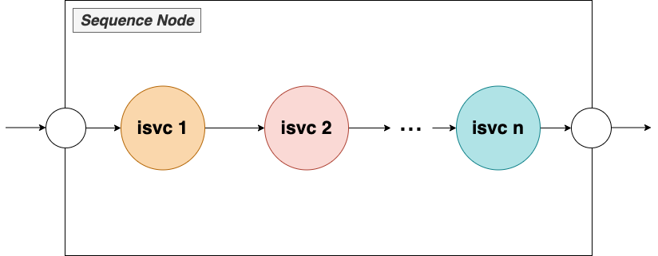
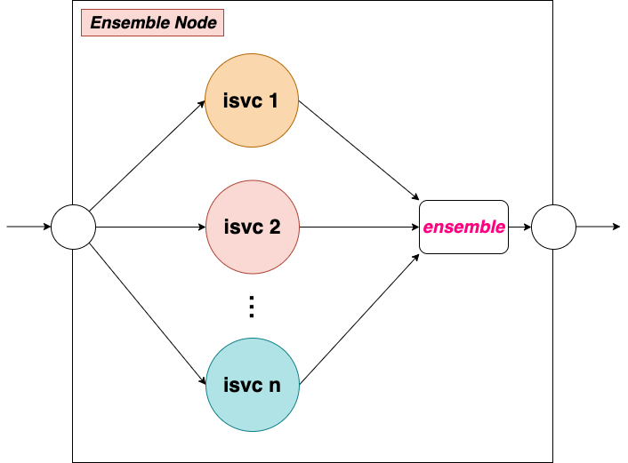
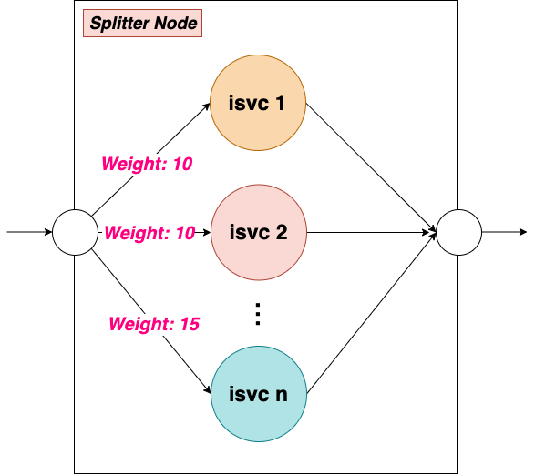

- [**Inference Graph**](#inference-graph)
  - [**1. Problem Statement**](#1-problem-statement)
  - [**2. KServe Inference Graph**](#2-kserve-inference-graph)
    - [**2.1 Inference Graph**](#21-inference-graph)
    - [**2.2 Sequence Node**](#22-sequence-node)
    - [**2.3 Switch Node**](#23-switch-node)
    - [**2.4 Ensemble Node**](#24-ensemble-node)
    - [**2.5 Splitter Node**](#25-splitter-node)

# **Inference Graph**
## **1. Problem Statement** 

Production inference pipelines are often composed of multiple inference services, models need to be chained together to produce the final prediction result.
For example, a face recognition pipeline may need to find the face area first and then compute the features of the faces to match the face database.
These two models depend on each other, and the first model’s output is the second model’s input. Another example is the NLP pipeline, it is common to run document classification
first and then run downstream named entity detection or text summary tasks.

KServe inference graph is designed for this.

## **2. KServe Inference Graph** 


### **2.1 Inference Graph**
As the above image shows, an inference graph is made up of a list of `routing nodes`, and each `routing node` consists of several steps with `InferenceService` or `Node` as the targets which is highly composable. 
Every graph must have a root node named `root`, when an inference request hits the graph, it executes the request starting from the `root` node of the DAG. If the graph has other `nodes` in the `Sequence`,
it will pass the `$request` or `$response` of the root node as input data to the `next node`. There are four `node` types that are supported: ***Sequence***, ***Switch***, ***Ensemble***, ***Splitter***.


### **2.2 Sequence Node**
**Sequence Node** allows users to connect multiple `InferenceServices` or `Nodes` in a sequence. The `steps` field defines the steps executed in sequence and returns a response after the last step on the sequence.
User can choose to pass `$request` or `$response` from each step as the input data to the next `InferenceService` or node in the sequence.


```yaml
...
root:
  routerType: Sequence 
  steps:
  - serviceName: isvc1
  - serviceName: isvc2
    data: $request
...
```

***Test steps***

1. Deploy the `InferenceService` and `InferenceGraph` [yaml](sequence.yaml)
```shell 
kubectl apply -f sequence.yaml
```
2. Wait for `InferenceService` and `InferenceGraph` to be ready.
```shell
kubectl get pods
NAME                                                              READY   STATUS    RESTARTS   AGE
model-chainer-00001-deployment-6bf7cf7776-zn5p4                   2/2     Running   0          32s
sklearn-iris-predictor-default-00001-deployment-8495cbf8cbdqfjg   2/2     Running   0          52s
xgboost-iris-predictor-default-00001-deployment-7b86bcdcf-7njrl   2/2     Running   0          50s

kubectl get isvc
NAME              URL                                                    READY   PREV   LATEST   PREVROLLEDOUTREVISION   LATESTREADYREVISION                       AGE
sklearn-iris      http://sklearn-iris.default.10.166.15.29.sslip.io      True           100                              sklearn-iris-predictor-default-00001      80m
xgboost-iris      http://xgboost-iris.default.10.166.15.29.sslip.io      True           100                              xgboost-iris-predictor-default-00001      80m

kubectl get ig
NAME            URL                                                  READY   AGE
model-chainer   http://model-chainer.default.10.166.15.29.sslip.io   True    5s
```
3. Test `InferenceGraph`.
```shell
curl http://model-chainer.default.10.166.15.29.sslip.io -d @./iris-input.json
``` 
***Expected result***
```shell
{"predictions":[1,1]}
```


### **2.3 Switch Node**
**Switch Node** allows users to select a step to execute the request by matching the `condition`, it returns the response back as soon as it matches the condition for one of the steps
in order, and if the is no `condition` matched, `inference graph` will return the `input data` directly. 


```yaml
...
root:
  routerType: Switch
  steps:
  - serviceUrl: http://single-1.default.{$your-domain}/switch
    condition: "[@this].#(source==client)" #object matching
  - serviceUrl: http://single-2.default.{$your-domain}/switch
    condition: "instances.#(intval>10)" #array matching
  - serviceUrl: http://single-3.default.{$your-domain}/switch 
    condition: "instances.#(strval%*red-server*)" #pattern matching
...
```
We use `https://github.com/tidwall/gjson` to parse and match the condition and [here](https://github.com/tidwall/gjson/blob/master/SYNTAX.md) is the `GJSON` syntax reference.

***Test steps***

1. Deploy the `InferenceService` and `InferenceGraph` [yaml](./switch.yaml)
```shell 
kubectl apply -f switch.yaml
```
2. Wait for `InferenceService` and `InferenceGraph` to be ready.
```shell
kubectl get pods
NAME                                                           READY   STATUS    RESTARTS   AGE
model-switch-00001-deployment-856876dfc8-d66cn                 2/2     Running   0          13m
single-1-predictor-default-00001-deployment-9fb5b49d4-9zx4h    2/2     Running   0          66m
single-2-predictor-default-00001-deployment-f44d84d54-f58t8    2/2     Running   0          66m
single-3-predictor-default-00001-deployment-6446f55849-tgvpq   2/2     Running   0          66m              

kubectl get isvc
NAME       URL                                             READY   PREV   LATEST   PREVROLLEDOUTREVISION   LATESTREADYREVISION                AGE
single-1   http://single-1.default.10.166.15.29.sslip.io   True           100                              single-1-predictor-default-00001   67m
single-2   http://single-2.default.10.166.15.29.sslip.io   True           100                              single-2-predictor-default-00001   67m
single-3   http://single-3.default.10.166.15.29.sslip.io   True           100                              single-3-predictor-default-00001   67m

kubectl get ig
NAME            URL                                                  READY   AGE
model-switch     http://model-switch.default.10.166.15.29.sslip.io     True    35s
```
3. Test `InferenceGraph`.
```shell
curl http://model-switch.default.10.166.15.29.sslip.io -d '{"source":"client1","instances":[{"name":"blue","intval":0,"strval":"kserve"},{"name":"green","intval":1,"strval":"1red-server1"}]}'
``` 
***Expected result***

Input data:
```json
{
    "source": "client1",
    "instances": [
        {
            "name": "blue",
            "intval": 0,
            "strval": "kserve"
        },
        {
            "name": "red",
            "intval":1,
            "strval": "1red-server1"
        }]
}
```
By evaluating the `switch conditions` with `input data`, the condition `"instances.#(strval%*red-server*)"` is matched, so you get the `response` from target service `single-3`. If there are multiple matched `conditions`, `inference graph` pickups the first matched condition in order and routes to the corresponding target service, and if there is no `condition` matched, `inference graph` returns the `input data` back directly.  
```shell
{"source":"single-3","instances":[{"name":"blue","intval":0,"strval":"kserve"},{"name":"green","intval":1,"strval":"1red-server1"}]}
```

### **2.4 Ensemble Node**
Scoring a case using a model ensemble consists of scoring it using each model separately, then combining the results into a single scoring result using one of the pre-defined combination methods.
Tree Ensemble constitutes a case where simple algorithms for combining results of either classification or regression trees are well known. 
Multiple classification trees, for example, are commonly combined using a "majority-vote" method. Multiple regression trees are often combined using various averaging techniques.



```yaml
...
root:
  routerType: Ensemble
  routes:
  - serviceName: sklearn-iris
    name: sklearn-iris
  - serviceName: xgboost-iris
    name: xgboost-iris
...
``

***Test steps***

1. Deploy the `InferenceService` and `InferenceGraph` [yaml](ensemble.yaml)
```shell 
kubectl apply -f switch.yaml
```
2. Wait for `InferenceService` and `InferenceGraph` to be ready.
```shell
kubectl get pods
NAME                                                              READY   STATUS    RESTARTS   AGE
ensemble-model-00001-deployment-7d48f984b6-qqqsh                  2/2     Running   0          32s
sklearn-iris-predictor-default-00001-deployment-8495cbf8cbdqfjg   2/2     Running   0          52s
xgboost-iris-predictor-default-00001-deployment-7b86bcdcf-7njrl   2/2     Running   0          50s

kubectl get isvc
NAME              URL                                                    READY   PREV   LATEST   PREVROLLEDOUTREVISION   LATESTREADYREVISION                       AGE
sklearn-iris      http://sklearn-iris.default.10.166.15.29.sslip.io      True           100                              sklearn-iris-predictor-default-00001      80m
xgboost-iris      http://xgboost-iris.default.10.166.15.29.sslip.io      True           100                              xgboost-iris-predictor-default-00001      80m

kubectl get ig
NAME            URL                                                  READY   AGE
ensemble-model   http://ensemble-model.default.10.166.15.29.sslip.io   True    15m
```
3. Test `InferenceGraph`.
```shell
curl http://ensemble-model.default.10.166.15.29.sslip.io -d @./iris-input.json
``` 
***Expected result***
```shell
{"sklearn-iris":{"predictions":[1,1]},"xgboost-iris":{"predictions":[1,1]}}
```

### **2.5 Splitter Node**
**Splitter Node** allows users to split traffic to multiple targets using a weighted distribution.


```yaml
...
root:
  routerType: Splitter 
  routes:
  - serviceName: sklearn-iris
    weight: 20
  - serviceName: xgboost-iris
    weight: 80
...    
```

***Test steps***

1. Deploy the demo `InferenceService` and `InferenceGraph` [yaml](./splitter.yaml)
```shell 
kubectl apply -f splitter.yaml
```
2. Wait for `InferenceService` and `InferenceGraph` to be ready.
```shell
kubectl get pods
NAME                                                              READY   STATUS    RESTARTS   AGE
splitter-model-00001-deployment-c5ccc95d5-lxhnb                   2/2     Running   0          15m
sklearn-iris-predictor-default-00001-deployment-8495cbf8cbdqfjg   2/2     Running   0          15m
xgboost-iris-predictor-default-00001-deployment-7b86bcdcf-7njrl   2/2     Running   0          15m

kubectl get isvc
NAME              URL                                                    READY   PREV   LATEST   PREVROLLEDOUTREVISION   LATESTREADYREVISION                       AGE
sklearn-iris      http://sklearn-iris.default.10.166.15.29.sslip.io      True           100                              sklearn-iris-predictor-default-00001      80m
xgboost-iris      http://xgboost-iris.default.10.166.15.29.sslip.io      True           100                              xgboost-iris-predictor-default-00001      80m

kubectl get ig
NAME            URL                                                  READY   AGE
splitter-model   http://splitter-model.default.10.166.15.29.sslip.io   True    15m
```
3. Test `InferenceGraph`.
```shell
curl http://splitter-model.default.10.166.15.29.sslip.io -d @./iris-input.json
``` 
***Expected result***
```shell
{"treeModel":{"predictions":[1,1]}}
```
