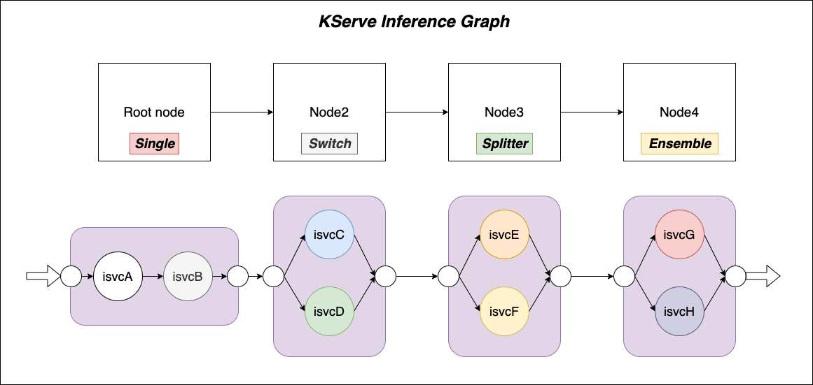
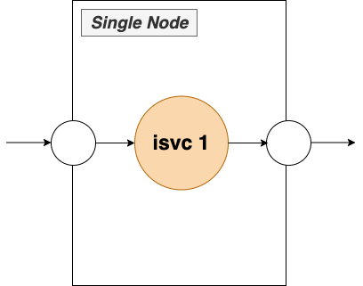
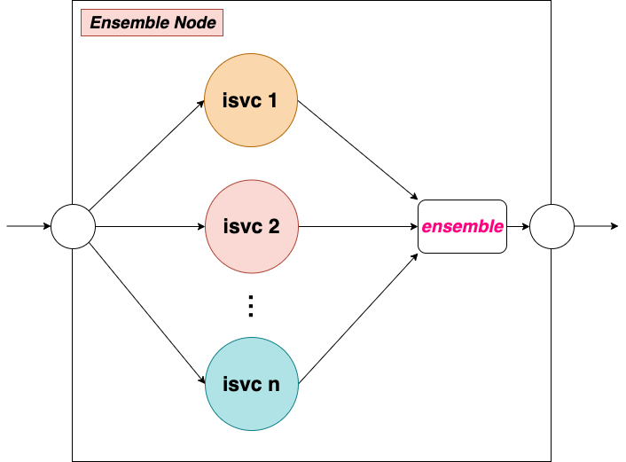
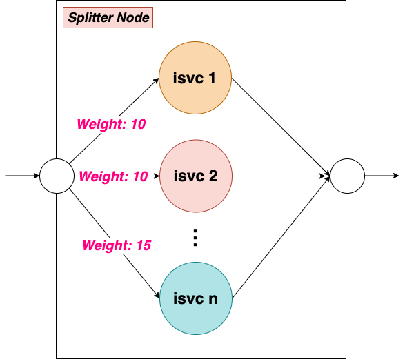

- [**Inference Graph**](#inference-graph)
  - [**1. Problem**](#1-problem)
  - [**2. KServe Inference Graph**](#2-kserve-inference-graph)
    - [**2.1 Inference Graph**](#21-inference-graph)
    - [**2.2 Single Node**](#22-single-node)
    - [**2.3 Switch Node**](#23-switch-node)
    - [**2.4 Ensemble Node**](#24-ensemble-node)
    - [**2.5 Splitter Node**](#25-splitter-node)
  - [**3 Examples**](#3-examples)
    - [**3.1 Single**](#31-single)
    - [**3.2 Switch**](#32-switch)
    - [**3.3 Splitter**](#33-splitter)
    - [**3.4 Ensemble**](#34-ensemble)
# **Inference Graph**
## **1. Problem** 

Production inference pipelines are often composed of multiple inference services, and models need to be chained together to produce the final prediction result. For example, a face recognition pipeline may need to find the face area first and then compute the features of the faces to match the face database. These two models depend on each other, and the first model’s output is the second model’s input. Another example is the NLP pipeline. It is very common to do some document classification and then have downstream tasks for named entity detection or text summary.[[...]](https://docs.google.com/document/d/13VHfOxa72pgoy5Eg5c-gGHZfEL7uBDc7rTLa2pAi4Ko/edit#heading=h.x9snb54sjlu9)

KServe inference graph is designed for this.

## **2. KServe Inference Graph** 

### **2.1 Inference Graph**
As the above image shows, an inference graph is made up of a list of `nodes`, and each `node` consists of several `isvcs`. Every graph must have a root node named `root`. When an inference request hits the graph, it executes the `root` node from the DAG. If the graph has other `nodes`, it will pass the `$request` or `$response` of the root service as input data to the `next node`. There are four `node` types that are supported: ***Single***, ***Switch***, ***Ensemble***, ***Splitter***.


### **2.2 Single Node**
**Single Node** allows users to connect two `isvcs` in a sequence relationship. The
`routes` field defines the first `isvc`, and if this node is not the tail node of the graph, it will have one `nextRoute` as the second `isvc`. User can choose `$request` or `$response` from the first `isvc` as the input data to send to the second `isvc`.


```yaml
...
root:
  routerType: Single 
  routes:
  - service: isvc1
  nextRoutes:
  - nodeName: isvc2
    data: $request
...
```
### **2.3 Switch Node**
**Switch Node** makes user can select an `isvc` to handle the request by setting the `condition`. Usually, user doesn't need to set the `serviceURL`, kserve will fill it with `isvc.status.address.URL` of `isvc`, but if you want to specified the `serviceURL`, you can set it manually. 


```yaml
mymodel:
  routerType: Switch
  routes:
  - service: isvc1
    serviceUrl: http://isvc1.default.example.com/splitter
    condition: "{.target == \"blue\"}"
  - service: isvc2
    serviceUrl: http://isvc2.default.example.com/splitter
    condition: "{.target != \"blue\"}"
  nextRoutes:
  - nodeName: isvcM
    data: $response
```
We use `k8s.io/client-go/util/jsonpath` to parse the condition, because the kubernetes jsonpath can not support `map` input, we make a change on the input data and `condition`:
* wrap the input data up to an `array`, for example: 

**origin input data:**
```json
{
  "target": "blue",
  "server_counter": 0,
  "target_counter": 8
}
```
**after convert**
```json
{
  "items": [
    {
      "target": "blue",
      "server_counter": 0,
      "target_counter": 8
    }
  ]
}
```
* change the `condition` to 

**origin condition**
```json
"{.target == \"blue\"}"
```
**after convert**
```json
"{@.items[?(.target==\"blue\")]}"
```

### **2.4 Ensemble Node**
Scoring a case using a model ensemble consists of scoring it using each model separately, then combining the results into a single scoring result using one of the pre-defined combination methods. Tree Ensemble constitutes a case where simple algorithms for combining results of either classification or regression trees are well known. Multiple classification trees, for example, are commonly combined using a "majority-vote" method. Multiple regression trees are often combined using various averaging techniques.

```yaml
root:
  routerType: Ensemble
  routes:
  - service: sklearn-iris
  - service: xgboost-iris
```
### **2.5 Splitter Node**
**Splitter Node** make user can  


```yaml
root:
  routerType: Splitter 
  routes:
  - service: sklearn-iris
    weight: 20
  - service: xgboost-iris
    weight: 80
```

## **3 Examples**
### **3.1 [Single](sequence.yaml)**
***Test steps***

1. Deploy the demo `isvc` and `graph` 
```shell 
kubectl apply -f sequence.yaml
```
2. Waiting for `isvc` and `graph` up.
```shell
kubectl get pods
NAME                                                              READY   STATUS    RESTARTS   AGE
model-chainer-00001-deployment-6bf7cf7776-zn5p4                   2/2     Running   0          32s
sklearn-iris-predictor-default-00001-deployment-8495cbf8cbdqfjg   2/2     Running   0          52s
xgboost-iris-predictor-default-00001-deployment-7b86bcdcf-7njrl   2/2     Running   0          50s

kubectl get isvc
NAME              URL                                                    READY   PREV   LATEST   PREVROLLEDOUTREVISION   LATESTREADYREVISION                       AGE
sklearn-iris      http://sklearn-iris.default.10.166.15.29.sslip.io      True           100                              sklearn-iris-predictor-default-00001      80m
xgboost-iris      http://xgboost-iris.default.10.166.15.29.sslip.io      True           100                              xgboost-iris-predictor-default-00001      80m

kubectl get ig
NAME            URL                                                  READY   AGE
model-chainer   http://model-chainer.default.10.166.15.29.sslip.io   True    5s
```
3. Tesing `graph`.
```shell
curl http://model-chainer.default.10.166.15.29.sslip.io -d @./iris-input.json
``` 
***Expect result***
```shell
{"treeModel":{"predictions":[1,1]}}
```
[***Demo yaml***](sequence.yaml)
### **3.2 [Switch](switch.yaml)**
***Test steps***

1. Deploy the demo `isvc` and `graph` 
```shell 
kubectl apply -f switch.yaml
```
2. Waiting for `isvc` and `graph` up.
```shell
kubectl get pods
NAME                                                              READY   STATUS    RESTARTS   AGE
blue-predictor-default-00002-deployment-855665bc49-m5vxt          2/2     Running   0          3m26s
green-predictor-default-00002-deployment-7485d64dbd-dgmbx         2/2     Running   0          3m26s
model-switch-00001-deployment-7ff47cdbb8-vxgp7                    2/2     Running   0          28s

kubectl get isvc
NAME              URL                                                    READY   PREV   LATEST   PREVROLLEDOUTREVISION   LATESTREADYREVISION                       AGE
blue              http://blue.default.10.166.15.29.sslip.io              True           100                              blue-predictor-default-00002              3d7h
green             http://green.default.10.166.15.29.sslip.io             True           100                              green-predictor-default-00002             3d7h

kubectl get ig
NAME            URL                                                  READY   AGE
model-switch     http://model-switch.default.10.166.15.29.sslip.io     True    35s
```
3. Tesing `graph`.
```shell
curl http://model-switch.default.10.166.15.29.sslip.io
``` 
***Expect result***
```shell
{"mymodel":{"server_counter":0,"target":"green","target_counter":2}}
```
[***Demo yaml***](switch.yaml)
### **3.3 [Splitter](splitter.yaml)**
***Test steps***

1. Deploy the demo `isvc` and `graph` 
```shell 
kubectl apply -f splitter.yaml
```
2. Waiting for `isvc` and `graph` up.
```shell
kubectl get pods
NAME                                                              READY   STATUS    RESTARTS   AGE
splitter-model-00001-deployment-c5ccc95d5-lxhnb                   2/2     Running   0          15m
sklearn-iris-predictor-default-00001-deployment-8495cbf8cbdqfjg   2/2     Running   0          15m
xgboost-iris-predictor-default-00001-deployment-7b86bcdcf-7njrl   2/2     Running   0          15m

kubectl get isvc
NAME              URL                                                    READY   PREV   LATEST   PREVROLLEDOUTREVISION   LATESTREADYREVISION                       AGE
sklearn-iris      http://sklearn-iris.default.10.166.15.29.sslip.io      True           100                              sklearn-iris-predictor-default-00001      80m
xgboost-iris      http://xgboost-iris.default.10.166.15.29.sslip.io      True           100                              xgboost-iris-predictor-default-00001      80m

kubectl get ig
NAME            URL                                                  READY   AGE
splitter-model   http://splitter-model.default.10.166.15.29.sslip.io   True    15m
```
3. Tesing `graph`.
```shell
curl http://splitter-model.default.10.166.15.29.sslip.io -d @./iris-input.json
``` 
***Expect result***
```shell
{"treeModel":{"predictions":[1,1]}}
```
[***Demo yaml***](splitter.yaml)
### **3.4 [Ensemble](ensemble.yaml)**
***Test steps***

1. Deploy the demo `isvc` and `graph` 
```shell 
kubectl apply -f switch.yaml
```
2. Waiting for `isvc` and `graph` up.
```shell
kubectl get pods
NAME                                                              READY   STATUS    RESTARTS   AGE
ensemble-model-00001-deployment-7d48f984b6-qqqsh                  2/2     Running   0          32s
sklearn-iris-predictor-default-00001-deployment-8495cbf8cbdqfjg   2/2     Running   0          52s
xgboost-iris-predictor-default-00001-deployment-7b86bcdcf-7njrl   2/2     Running   0          50s

kubectl get isvc
NAME              URL                                                    READY   PREV   LATEST   PREVROLLEDOUTREVISION   LATESTREADYREVISION                       AGE
sklearn-iris      http://sklearn-iris.default.10.166.15.29.sslip.io      True           100                              sklearn-iris-predictor-default-00001      80m
xgboost-iris      http://xgboost-iris.default.10.166.15.29.sslip.io      True           100                              xgboost-iris-predictor-default-00001      80m

kubectl get ig
NAME            URL                                                  READY   AGE
ensemble-model   http://ensemble-model.default.10.166.15.29.sslip.io   True    15m
```
3. Tesing `graph`.
```shell
curl http://ensemble-model.default.10.166.15.29.sslip.io -d @./iris-input.json
``` 
***Expect result***
```shell
{"http://sklearn-iris.default.svc.cluster.local/v2/models/sklearn-iris/infer":{"predictions":[1,1]},"http://xgboost-iris.default.svc.cluster.local/v2/models/xgboost-iris/infer":{"predictions":[1,1]}}
```
[***Demo yaml***](ensemble.yaml)