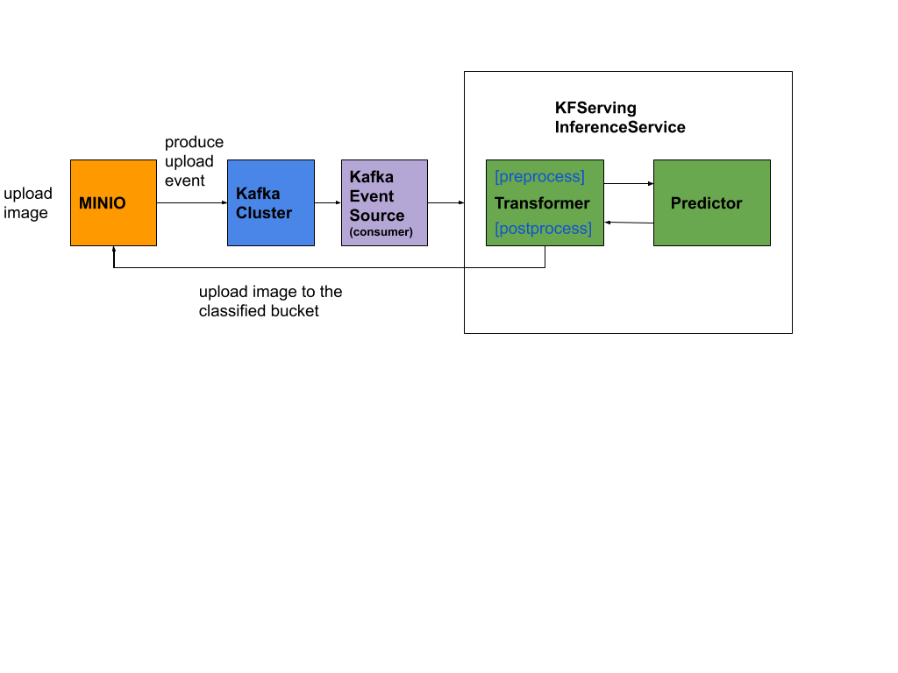

# End to end inference example with Minio and Kafka
## Setup
1. Your ~/.kube/config should point to a cluster with [KFServing installed](https://github.com/kubeflow/kfserving/#install-kfserving).
2. Your cluster's Istio Ingress gateway must be [network accessible](https://istio.io/latest/docs/tasks/traffic-management/ingress/ingress-control/).
3. Install Minio with following Minio deploy step.
4. Use existing Kafka cluster or install Kafka on your cluster with [Confluent helm chart](https://www.confluent.io/blog/getting-started-apache-kafka-kubernetes/).
5. Install [Kafka Event Source](https://github.com/knative/eventing-contrib/tree/master/kafka/source).
6. Kubernetes 1.15+
7. KFServing 0.3+

This example shows an end to end inference pipeline which processes an kafka event and invoke the inference service to get the prediction with provided
pre/post processing code.



## Deploy Kafka
If you do not have an existing kafka cluster, you can run the following commands to install in-cluster kafka using [helm3](https://helm.sh)
with persistence turned off.

```
helm repo add confluentinc https://confluentinc.github.io/cp-helm-charts/
helm repo update
helm install my-kafka -f values.yaml --set cp-schema-registry.enabled=false,cp-kafka-rest.enabled=false,cp-kafka-connect.enabled=false confluentinc/cp-helm-charts
```

after successful install you are expected to see the running kafka cluster
```bash
NAME                      READY   STATUS    RESTARTS   AGE
my-kafka-cp-kafka-0       2/2     Running   0          126m
my-kafka-cp-kafka-1       2/2     Running   1          126m
my-kafka-cp-kafka-2       2/2     Running   0          126m
my-kafka-cp-zookeeper-0   2/2     Running   0          127m
```

## Install Knative Eventing and Kafka Event Source
- Install [Knative Eventing Core >= 0.18](https://knative.dev/docs/install/any-kubernetes-cluster/#installing-the-eventing-component)
- Install [Kafka Event Source](https://github.com/knative-sandbox/eventing-kafka/releases).
- Install `InferenceService` addressable cluster role
```bash
kubectl apply -f addressable-resolver.yaml
```

## Deploy Minio
- If you do not have Minio setup in your cluster, you can run following command to install Minio test instance.
```bash
kubectl apply -f minio.yaml
```

- Install Minio client [mc](https://docs.min.io/docs/minio-client-complete-guide)
```bash
kubectl port-forward $(kubectl get pod --selector="app=minio" --output jsonpath='{.items[0].metadata.name}') 9000:9000
mc config host add myminio http://127.0.0.1:9000 minio minio123
```
- Create buckets `mnist` for uploading images and `digit-[0-9]` for classification.
```bash
mc mb myminio/mnist
mc mb myminio/digit-[0-9]
```

- Setup event notification to publish events to kafka.
```bash
# Setup bucket event notification with kafka
mc admin config set myminio notify_kafka:1 tls_skip_verify="off"  queue_dir="" queue_limit="0" sasl="off" sasl_password="" sasl_username="" tls_client_auth="0" tls="off" client_tls_cert="" client_tls_key="" brokers="my-kafka-cp-kafka-headless:9092" topic="mnist" version=""

# Setup event notification when putting images to the bucket
mc event add myminio/mnist arn:minio:sqs:1:kafka -p --event put --suffix .png

# Restart minio
mc admin service restart myminio
```

## Upload the mnist model to Minio
```
gsutil cp -r gs://kfserving-examples/models/tensorflow/mnist .
mc cp -r mnist myminio/
```

Alternatively you can copy the saved model from `` and upload to Minio `mnist` bucket.

## Create S3 Secret for Minio and attach to Service Account
`KFServing` gets the secrets from your service account, you need to add the created or existing secret to your service account's secret list. 
By default `KFServing` uses `default` service account, user can use own service account and overwrite on `InferenceService` CRD.

Apply the secret and attach the secret to the service account.
```bash
kubectl apply -f s3_secret.yaml
```

## Build mnist transformer image
The transformation image implements the preprocess handler to process the minio notification event to download the image from minio
and transform image bytes to tensors. The postprocess handler processes the prediction and upload the image to the classified minio
bucket `digit-[0-9]`.
```bash
docker build -t $USER/mnist-transformer:latest -f ./transformer.Dockerfile . --rm
docker push $USER/mnist-transformer:latest
```

## Create the InferenceService
Specify the built image on `Transformer` spec and apply the inference service CRD.
```bash
kubectl apply -f mnist_kafka.yaml 
```

This creates transformer and predictor pods, the request goes to transformer first where it invokes the preprocess handler, transformer
then calls out to predictor to get the prediction response which in turn invokes the postprocess handler. 
```
kubectl get pods -l serving.kubeflow.org/inferenceservice=mnist
mnist-predictor-default-9t5ms-deployment-74f5cd7767-khthf     2/2     Running       0          10s
mnist-transformer-default-jmf98-deployment-8585cbc748-ftfhd   2/2     Running       0          14m
```

## Create kafka event source
Apply kafka event source which creates the kafka consumer pod to pull the events from kafka and deliver to inference service.
```bash
kubectl apply -f kafka-source.yaml
```

This creates the kafka source pod which consumers the events from `mnist` topic
```bash
kafkasource-kafka-source-3d809fe2-1267-11ea-99d0-42010af00zbn5h   1/1     Running   0          8h
```

## Upload a digit image to Minio mnist bucket
The last step is to upload the image `images/0.png`, image then should be moved to the classified bucket based on the prediction response!
```bash
mc cp images/0.png myminio/mnist
```
you should expect a notification event like following sent to kafka topic `mnist` after uploading an image in `mnist` bucket
```json
{
   "EventType":"s3:ObjectCreated:Put",
   "Key":"mnist/0.png",
   "Records":[
      {"eventVersion":"2.0",
       "eventSource":"minio:s3",
       "awsRegion":"",
       "eventTime":"2019-11-17T19:08:08Z",
       "eventName":"s3:ObjectCreated:Put",
       "userIdentity":{"principalId":"minio"},
       "requestParameters":{"sourceIPAddress":"127.0.0.1:37830"},
       "responseElements":{"x-amz-request-id":"15D808BF706E0994",
       "x-minio-origin-endpoint":"http://10.244.0.71:9000"},
       "s3":{
          "s3SchemaVersion":"1.0",
          "configurationId":"Config",
          "bucket":{
               "name":"mnist",
               "ownerIdentity":{"principalId":"minio"},
               "arn":"arn:aws:s3:::mnist"},
          "object":{"key":"0.png","size":324,"eTag":"ebed21f6f77b0a64673a3c96b0c623ba","contentType":"image/png","userMetadata":{"content-type":"image/png"},"versionId":"1","sequencer":"15D808BF706E0994"}},
          "source":{"host":"","port":"","userAgent":""}}
   ],
   "level":"info",
   "msg":"",
   "time":"2019-11-17T19:08:08Z"
}
```

Check the transformer log, you should expect a prediction response and put the image to the corresponding bucket
```bash
kubectl logs mnist-transformer-default-rctjm-deployment-54d59c849c-2dq98  kfserving-container
[I 201128 22:32:27 kfserver:88] Registering model: mnist
[I 201128 22:32:27 kfserver:77] Listening on port 8080
[I 201128 22:32:27 kfserver:79] Will fork 0 workers
[I 201128 22:32:27 process:123] Starting 6 processes
[I 201128 22:32:44 connectionpool:203] Starting new HTTP connection (1): minio-service
[I 201128 22:32:58 image_transformer:51] {'predictions': [{'predictions': [0.0247901566, 1.37231364e-05, 0.0202635303, 0.39037028, 0.000513458275, 0.435112566, 0.000607515569, 0.00041125578, 0.127784252, 0.000133168287], 'classes': 5}]}
[I 201128 22:32:58 image_transformer:53] digit:5
```

