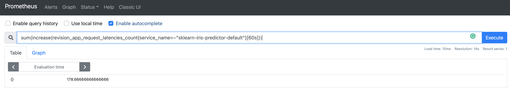
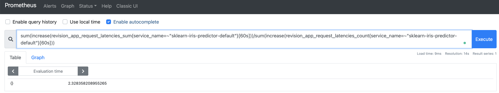

# Metrics and Monitoring

> Getting started with Prometheus-based monitoring of KFServing models.

# Table of Contents
1. [Install Prometheus](#install-prometheus)
2. [Access Prometheus Metrics](#access-prometheus-metrics)
3. [Metrics-driven experiments and progressive delivery](#metrics-driven-experiments-and-progressive-delivery)
4. [Removal](#removal)

## Install Prometheus

**Prerequisites:** Kubernetes cluster and [Kustomize v3](https://kubectl.docs.kubernetes.io/installation/kustomize/).

Install Prometheus using Prometheus Operator.

```shell
cd kfserving
kustomize build docs/samples/metrics-and-monitoring/prometheus-operator | kubectl apply -f -
kubectl wait --for condition=established --timeout=120s crd/prometheuses.monitoring.coreos.com
kubectl wait --for condition=established --timeout=120s crd/servicemonitors.monitoring.coreos.com
kustomize build docs/samples/metrics-and-monitoring/prometheus | kubectl apply -f -
```

> Note: The above steps install Kubernetes resource objects in the `kfserving-monitoring` namespace. This is Kustomizable. To install under a different namespace, say `my-monitoring`, change `kfserving-monitoring` to `my-monitoring` in the following three files: a) `prometheus-operator/namespace.yaml`, b) `prometheus-operator/kustomization.yaml`, and c) `prometheus/kustomization.yaml`.

## Access Prometheus Metrics
In this section, we will use a v1beta1 InferenceService sample to demonstrate how to access Prometheus metrics that are automatically generated by [Knative's queue-proxy container](https://knative.dev) for your KFServing models.

1. `kubectl create ns kfserving-test`
2. `cd docs/samples/v1beta1/sklearn`
3. `kubectl apply -f sklearn.yaml -n kfserving-test`
4. If you are using a Minikube based cluster, then in a separate terminal, run `minikube tunnel --cleanup` and supply password if prompted.
5. In a separate terminal, follow [these instructions](https://github.com/kubeflow/kfserving/blob/master/README.md#determine-the-ingress-ip-and-ports) to find and set your ingress IP, host, and service hostname. Then, send prediction requests to the `sklearn-iris` model you created in Step 3. above as follows.
```
while clear; do \
  curl -v \
  -H "Host: ${SERVICE_HOSTNAME}" \
  -d @./iris-input.json \
  http://${INGRESS_HOST}:${INGRESS_PORT}/v2/models/sklearn-iris/infer
  sleep 0.3
done
```
6. In a separate terminal, port forward the Prometheus service.
```shell
kubectl port-forward service/prometheus-operated -n kfserving-monitoring 9090:9090
```
7. Access Prometheus UI in your browser at http://localhost:9090
8. Access the number of prediction requests to the sklearn model, over the last 60 seconds. You can use the following query in the Prometheus UI: 

```
sum(increase(revision_app_request_latencies_count{service_name=~"sklearn-iris-predictor-default"}[60s]))
``` 

You should see a response similar to the following.



9. Access the mean latency for serving prediction requests for the same model as above, over the last 60 seconds. You can use the following query in the Prometheus UI:

```
sum(increase(revision_app_request_latencies_sum{service_name=~"sklearn-iris-predictor-default"}[60s]))/sum(increase(revision_app_request_latencies_count{service_name=~"sklearn-iris-predictor-default"}[60s]))
```

You should see a response similar to the following.



## Metrics-driven experiments and progressive delivery
See [Iter8 extensions for kfserving](https://iter8.tools).

## Removal
Remove Prometheus and Prometheus Operator as follows.
```shell
cd kfserving
kustomize build docs/samples/metrics-and-monitoring/prometheus | kubectl delete -f -
kustomize build docs/samples/metrics-and-monitoring/prometheus-operator | kubectl delete -f -
```
