# Benchmark of Multi-Model Serving

The following stress and performance tests have been executed to support that Multi-Model Serving is a solution to the model deployment scalability problem as discussed in the [MMS Guide](../../../MULTIMODELSERVING_GUIDE.md).

## Stress Test
To determine the maximum amount of models that can be deployed
- Environment Setup:
    - kfserving: v0.5.1
    - knative: v0.17.0
    - istio: v1.7.x
- Cluster limitation:
    - Maximum 2048 IP Addresses
    - Maximum 0.55 TiB memory per worker node
    - Maximum ~2000 kubernetes services resources
        - Limited by istio ingress gateway
    - Maximum 660 pods on worker nodes
        - Maximum 110 pods per worker node
        - 6 total worker nodes
    - ETCD size of 65 MiB
- Inference Service:
    - apiVersion: `serving.kserve.io/v1beta1`
    - concurrency: 1
    - minReplicas: 1
    - Triton model server
    - Queue_proxy: CPU 1, Memory 500Mi
    - Traditional Model Serving Predictor Spec: CPU 100m, Memory 100Mi
    - Multi-Model Serving Predictor Spec: CPU 10, Memory 10Gi
- Model:
    - [Simple string](https://github.com/triton-inference-server/server/tree/b5a5541d3252a9fb235eeea9c156eb0d2f8ab883/docs/examples/model_repository/simple_string)
    - Size of 700B
    - Tensorflow framework

### Baseline:
- Test Summary:
    - The traditional model serving was able to deploy `352 InferenceServices`
    - Multi-model serving was able to deploy `~10K models using 6 InferenceService` which equates to `2800%` more models loaded
    - Overall, Multi-Model Serving utilises less CPU and memory while deploying more
        - The traditional model serving used a total of `387 CPU` and `211 GB`
        - Multi-model serving used a total of `66 CPU` and `63 GB`
        - Comparing the queue-proxy usage
            - The traditional model serving queue-proxies used `352 CPU` and `176 GB`
            - Multi-model serving queue-proxies used `6 CPU` and `3 GB`
    - Adding/removing models in multi-model serving causes new configmap versions to be generated without ETCD getting the chance to remove the previous versions. This can exhaust the memory of ETCD in case of deploying thousands of models
        - Should consider an external storage to store models

## Performance Test
To compare the latency between traditional model serving and multi-model serving
- Environment Setup:
    - kfserving: v0.5.1
    - knative: v0.17.0
    - istio: v1.7.x
- Inference Service:
    - apiVersion: `serving.kserve.io/v1beta1`
    - concurrency: 1
    - minReplicas: 1
    - Triton model server
    - Queue_proxy: 1 CPU and 500Mi
    - Simple String:
        - Traditional Model Serving Predictor Spec: CPU 1, Memory 16GB, GPU 1
        - Multi-Model Serving Predictor Spec: CPU 1, Memory 16GB, GPU 1
    - Bert:
        - Traditional Model Serving Predictor Spec: CPU 1, Memory 16GB, GPU 1
        - Multi-Model Serving Predictor Spec: CPU 1, Memory 16GB, GPU 1
- Vegeta loading test agent:
    - Simple String (CPU):
        - model size of 700B
        - testing duration 1 min
        - Queries per second (QPS): 5/sec, 10/sec, 20/sec, 30/sec, 40/sec, 50/sec, 100/sec
    - Bert (GPU):
        - testing duration 1 min
        - Queries per second (QPS): 5/sec, 10/sec, 20/sec, 30/sec, 40/sec

### Simple String test (CPU)
- Test Summary:
    - The traditional model serving using 5 inferenceService is able to handle up to `2500 queries per second` without scaling
    - Multi-model serving with 1 inferenceservice and 5 trainedModels starts to scale up at `500 queries per second`
    - The relative latency between traditional and multi-model serving seems comparable when not scaling up
    - Multi-model serving seems to be more sensitive to autoscaling
- Test Results:
    - Traditional model serving with 5 inferenceServices

      | Client side QPS | QPS per InferenceService (model) | mean | p50 | p90 | p95 | p99 | max |
      | --- | --- | --- | --- | --- | --- | --- | --- |
      | 25 | 5 | 3.763 | 3.669 | 4.089 | 4.222 | 4.511 | 43.877 |
      | 50 | 10 | 3.78 | 3.546 | 3.936 | 4.097 | 6.956 | 220.716 |
      | 100 | 20 | 3.594 | 3.496 | 3.875 | 4.008 | 4.438 | 84.529 |
      | 150 | 30 | 3.59 | 3.294 | 3.642 | 3.744 | 6.191 | 260.923 |
      | 200 | 40 | 3.508 | 3.169 | 3.535 | 3.631 | 5.659 | 205.389 |
      | 250 | 50 | 3.882 | 3.288 | 3.559 | 3.642 | 9.411 | 302.492 |
      | 500 | 100 | 4.282 | 3.086 | 3.471 | 3.604 | 52.807 | 324.815 |
      | 1000 | 200 | 6.266 | 3.062 | 3.436 | 6.7 | 116.774 | 308.413 |
      | 1500 | 300 | 10.365 | 2.828 | 5.901 | 55.38 | 183.41 | 1039 |
      | 2000 | 400 | 9.338 | 2.783 | 4.288 | 32.912 | 178.837 | 1058 |
      | 2500 | 500 | 11.796 | 2.719 | 8.509 | 64.447 | 217.911 | 1043 |

    - Multi-model serving with 1 inferenceService and 5 TrainedModels

        | Client side QPS | QPS per InferenceService | QPS per TrainedModel | mean | p50 | p90 | p95 | p99 | max |
        | --- | --- | --- | --- | --- | --- | --- | --- | --- |
        | 25 | 25 | 5 | 4.453 | 3.85 | 4.181 | 4.282 | 26.465 | 138.671 |
        | 50 | 50 | 10 | 4.081 | 3.676 | 3.934 | 4.048 | 11.653 | 107.775 |
        | 100 | 100 | 20 | 5.051 | 3.304 | 3.625 | 3.772 | 72.291 | 193.219 |
        | 150 | 150 | 30 | 4.403 | 3.399 | 3.684 | 3.823 | 46.981 | 119.896 |
        | 200 | 200 | 40 | 6.071 | 3.296 | 3.63 | 8.587 | 90.514 | 203.785 |
        | 250 | 250 | 50 | 6.846 | 3.223 | 3.575 | 23.825 | 100.167 | 351.26 |
        | 500 | 500 | 100 | 260.202 | 2.846 | 1298| 2025| 2241| 2475 |

    At 500 QPS the multi-model serving starts to scale up which causes the latency to dramatically increase. The benchmark for this case will stop at 500 QPS because 500+ QPS will lead to pods scaling which is not what the focus should be on.

    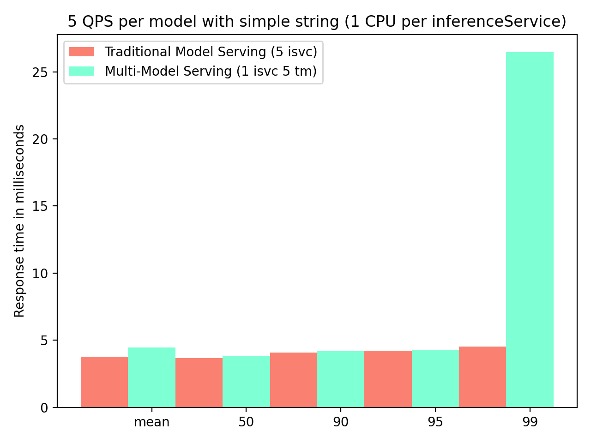
    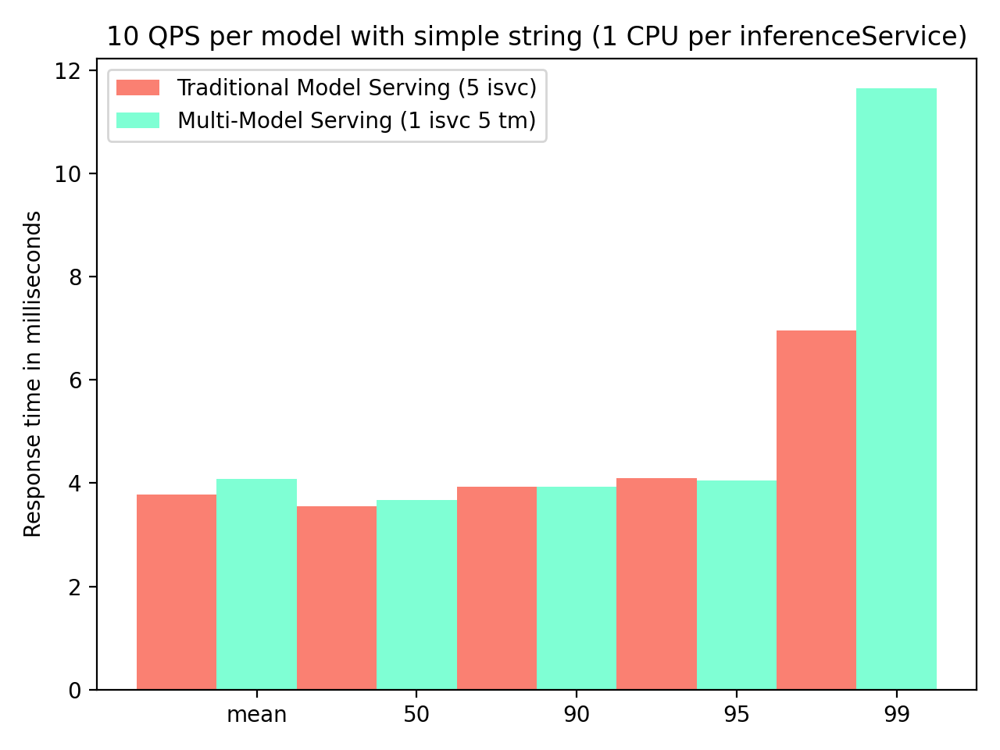
    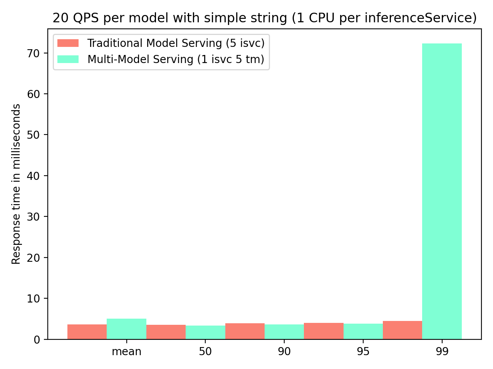
    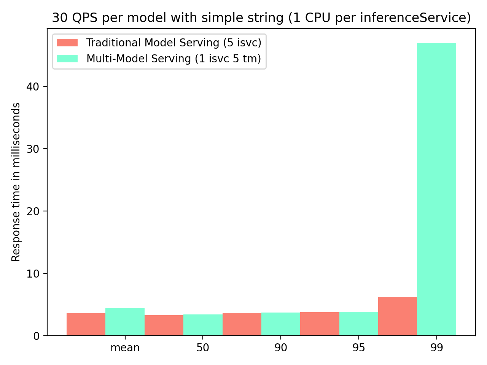
    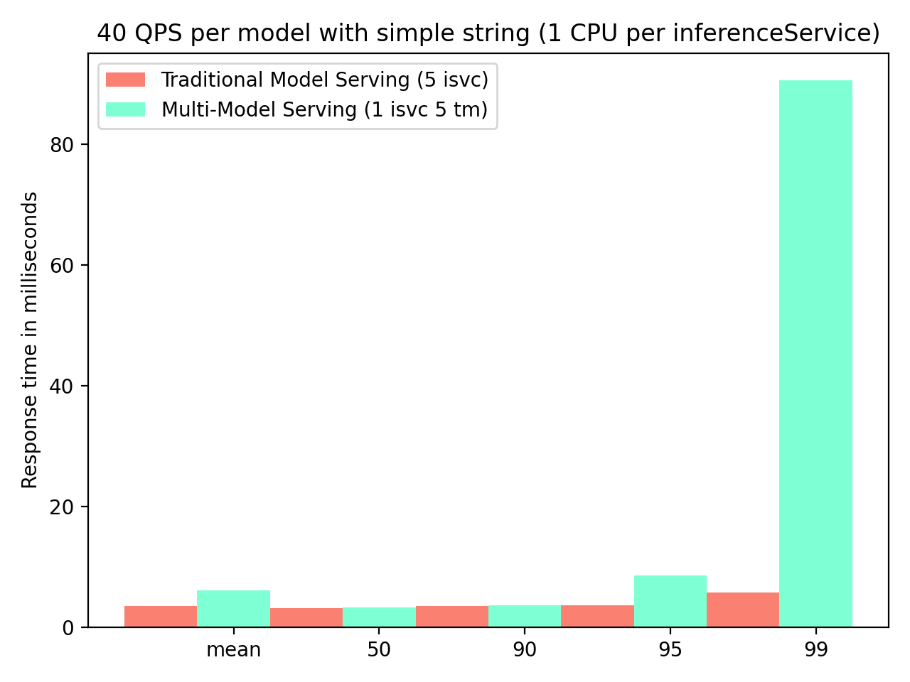
    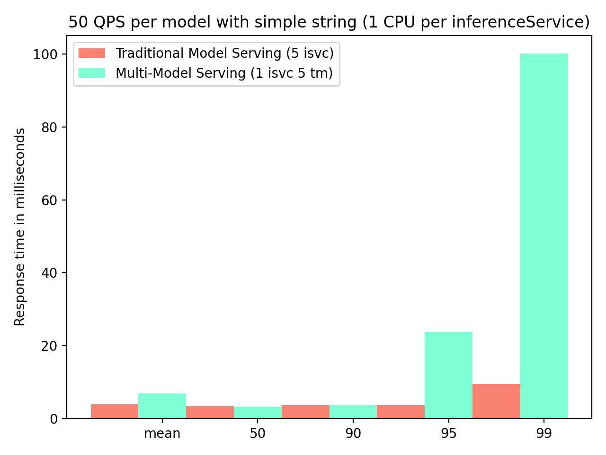
    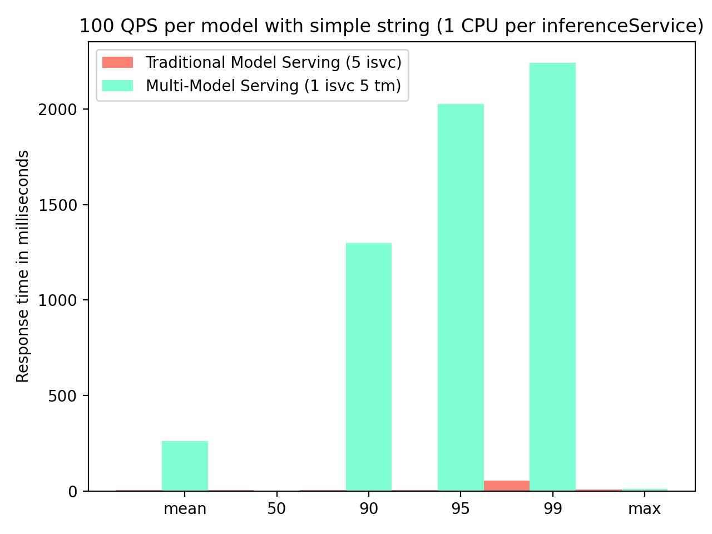

### Bert test (GPU)
- Test Summary:
    - The traditional model serving using 5 inferenceService is able to handle up to `200 queries per second` without scaling
    - Multi-model serving with 1 inferenceservice and 5 trainedModels is able to handle up to `40 queries per second` without scaling
    - The latency is relatively the same for traditional and multi-model serving
    - Multi-model serving seems to be more sensitive to autoscaling
- Test Results:
    - Traditional model serving with 5 inferenceServices

      | Client side QPS | QPS per InferenceService (model) | mean | p50 | p90 | p95 | p99 | max |
      | --- | --- | --- | --- | --- | --- | --- | --- |
      | 5 | 1 | 33.845ms | 32.986ms | 36.644ms | 41.596ms | 100.959ms | 131.195ms |
      | 10 | 2 | 34.212ms | 32.058ms | 42.791ms | 55.192ms | 89.832ms | 154.485ms |
      | 20 | 4 | 30.133ms | 31.262ms | 33.721ms | 35.142ms | 40.981ms | 102.801ms |
      | 30 | 6 | 30.726ms | 30.32ms | 33.607ms | 37.405ms | 64.624ms | 700.839ms |
      | 40 | 8 | 29.646ms | 29.785ms | 32.164ms | 32.856ms | 39.188ms | 792.061ms |
      | 50 | 10 | 29.458ms | 29.519ms | 32.725ms | 33.833ms | 44.221ms | 670.303ms |
      | 100 | 20 | 26.844ms | 25.783ms | 31.322ms | 32.179ms | 39.265ms | 811.652ms |
      | 200 | 40 | 51.627ms | 25.389ms | 107.946ms | 175.522ms | 321.154ms | 1.616s|

    - Multi-Model Serving with 1 inferenceService and 5 trainedmodels

        | Client side QPS | QPS per InferenceService | QPS per TrainedModel | mean | p50 | p90 | p95 | p99 | max |
        | --- | --- | --- | --- | --- | --- | --- | --- | --- |
        | 5 | 5 | 1 | 30.978ms | 30.195ms | 32.435ms | 52.474ms | 59.936ms | 139.195ms |
        | 10 | 10 | 2 | 31.903ms | 32.795ms | 35.105ms | 37.138ms | 48.254ms | 266.965m |
        | 20 | 20 | 4 | 29.782ms | 30.777ms | 34.452ms | 36.409ms | 46.074ms | 256.518ms |
        | 30 | 30 | 6 | 24.929ms | 23.548ms | 30.218ms | 30.935ms | 49.506ms | 205.663ms |
        | 40 | 40 | 8 | 34.087ms | 24.483ms | 50.588ms | 87.01ms | 155.853ms | 801.393ms |

    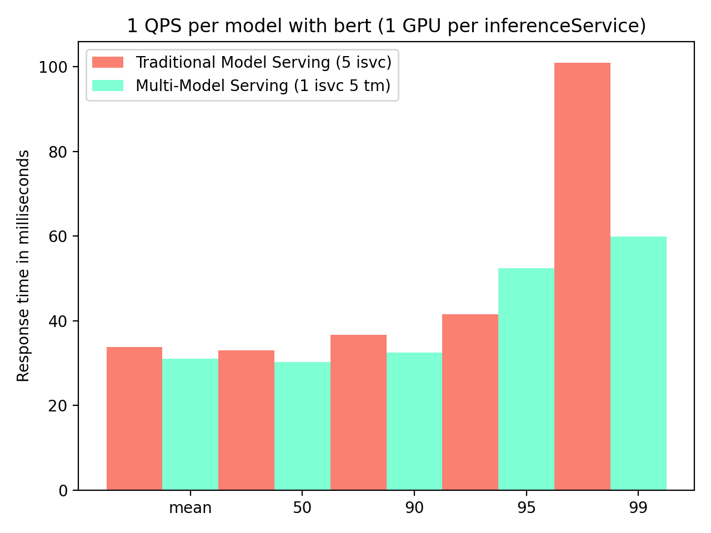
    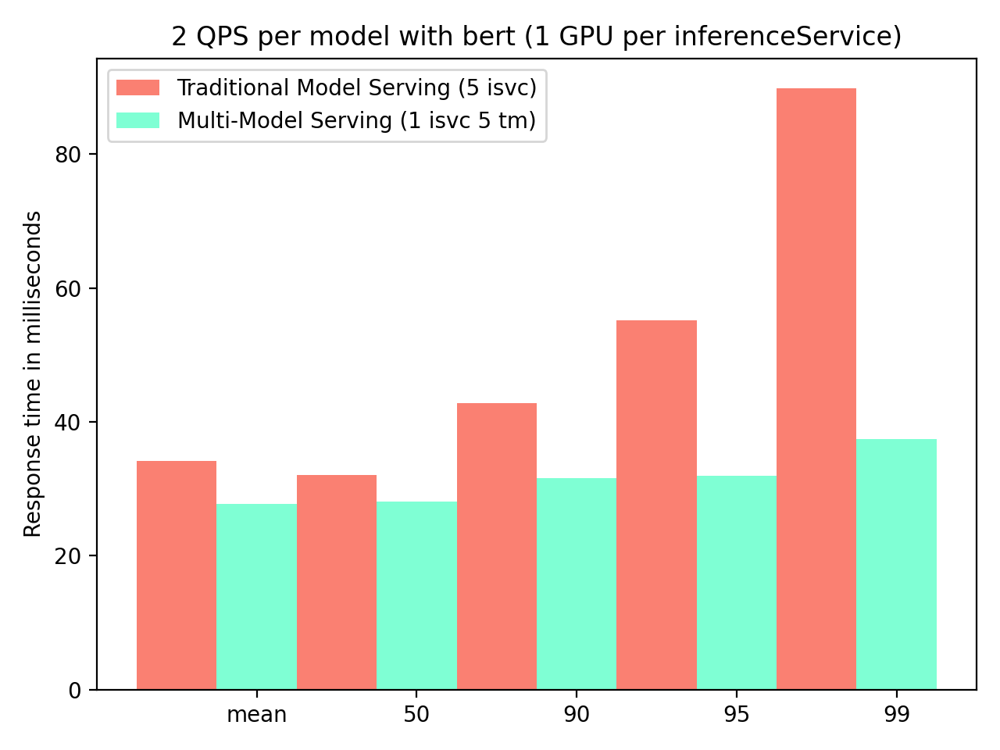
    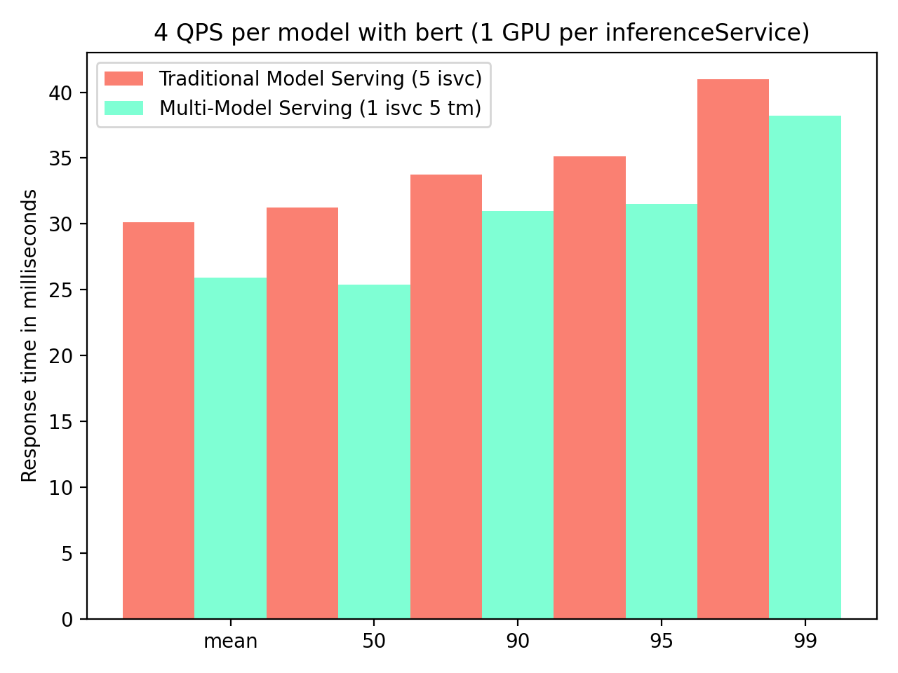
    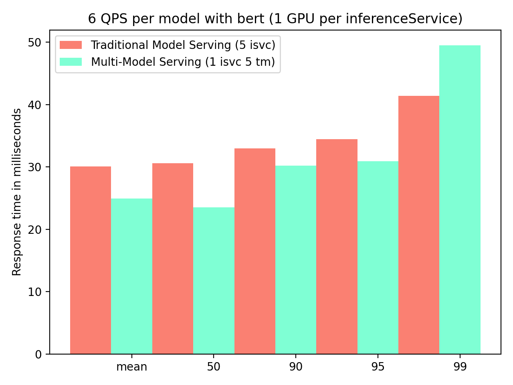
    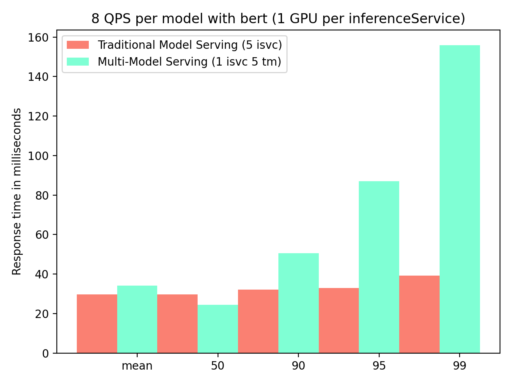
