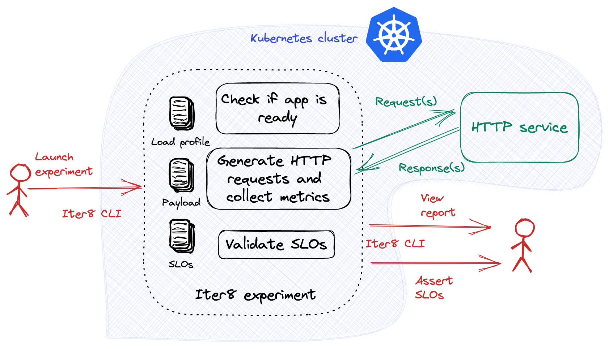
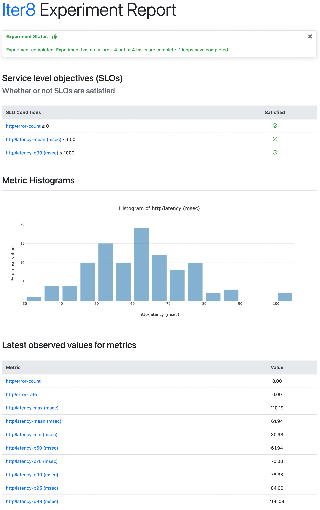

# HTTP Performance test

This tutorial demonstrates performance testing for KServe inference services using HTTP. We will use [Iter8](https://iter8.tools) for generating load and validing service-level objectives (SLOs) for the inference service. [Iter8](https://iter8.tools) is an open-source Kubernetes release optimizer that makes it easy to ensure that your ML models perform well and maximize business value.



***

> Performance testing of KServe inference services using gRPC is described [here](grpc.md). Canary testing using Prometheus metrics is described [here](../canary-testing/README.md). This tutorial focuses on performance testing of KServe inference services with HTTP endpoints. The main steps in this tutorial are:
> 1. [Deploy an InferenceService](#deploy-an-inferenceservice)
> 2. [Launch an Iter8 experiment](#launch-an-iter8-experiment)
> 3. [View experiment report](#view-experiment-report)

***

## Deploy an InferenceService

Create an InferenceService that exposes an HTTP port. The following serves the Scikit-learn [irisv2 model](https://kserve.github.io/website/0.10/modelserving/v1beta1/sklearn/v2/#deploy-with-inferenceservice):

```shell
cat <<EOF | kubectl apply -f -
apiVersion: "serving.kserve.io/v1beta1"
kind: "InferenceService"
metadata:
  name: "sklearn-irisv2"
spec:
  predictor:
    model:
      modelFormat:
        name: sklearn
      runtime: kserve-mlserver
      storageUri: "gs://seldon-models/sklearn/mms/lr_model"
EOF
```

Verify that your inference service is ready.

```shell
kubectl wait --for=condition=Ready --timeout=600s isvc/sklearn-irisv2
```

## Install Iter8 CLI
Install the Iter8 CLI using `brew` as follows. You can also install using pre-built binaries as described [here](https://iter8.tools/0.13/getting-started/install/).

```shell
brew tap iter8-tools/iter8
brew install iter8@0.13
```

## Launch an Iter8 experiment
Iter8 introduces the notion of an *experiment* that makes it easy to verify that your inference service is ready, generate load for the inference, collect latency and error-related metrics, and assess SLOs for performance validation. Launch the Iter8 experiment inside the Kubernetes cluster.

```shell
iter8 k launch \
--set "tasks={ready,http,assess}" \
--set ready.isvc=sklearn-irisv2 \
--set ready.timeout=600s \
--set http.url=http://sklearn-irisv2.default.svc.cluster.local/v2/models/sklearn-irisv2/infer \
--set http.payloadURL=https://gist.githubusercontent.com/kalantar/d2dd03e8ebff2c57c3cfa992b44a54ad/raw/97a0480d0dfb1deef56af73a0dd31c80dc9b71f4/sklearn-irisv2-input.json \
--set http.contentType="application/json" \
--set http.warmupNumRequests=50 \
--set assess.SLOs.upper.http/latency-mean=500 \
--set assess.SLOs.upper.http/latency-p90=1000 \
--set assess.SLOs.upper.http/error-count=0 \
--set runner=job
```

### More about this Iter8 experiment

1. This experiment consists of three [tasks](https://iter8.tools/0.13/getting-started/concepts/#iter8-experiment), namely, [ready](https://iter8.tools/0.13/user-guide/tasks/ready), [http](https://iter8.tools/0.13/user-guide/tasks/http), and [assess](https://iter8.tools/0.13/user-guide/tasks/assess).

    * The [ready](https://iter8.tools/0.13/user-guide/tasks/ready) task checks if the `sklearn-irisv2` inference service exists and is ready to serve user requests.

    * The [http](https://iter8.tools/0.13/user-guide/tasks/http) task sends requests to the cluster-local HTTP service whose URL is `http://sklearn-irisv2.default.svc.cluster.local/v2/models/sklearn-irisv2/infer`, and collects [Iter8's built-in HTTP load test metrics](https://iter8.tools/0.13/user-guide/tasks/http#metrics). As part of these requests, it uses the JSON data at [this payloadURL](https://gist.githubusercontent.com/kalantar/d2dd03e8ebff2c57c3cfa992b44a54ad/raw/97a0480d0dfb1deef56af73a0dd31c80dc9b71f4/sklearn-irisv2-input.json) as the payload.

    * The [assess](https://iter8.tools/0.13/user-guide/tasks/assess) task verifies if the app satisfies the specified SLOs: i) the mean latency of the service does not exceed 500 msec, ii) the 90th percentile latency of the service does not exceed 1000 msec, and iii) there are no errors (4xx or 5xx response codes) in the responses.

2. This is a single-loop in which all the previously mentioned tasks will run once and the experiment will finish.

## View experiment report
```shell
iter8 k report -o html > report.html # view in a browser
```

Below is a sample HTML report.



You can also [assert various conditions](https://iter8.tools/0.13/getting-started/your-first-experiment/#assert-experiment-outcomes) about the outcome of the experiment and [view the execution logs](https://iter8.tools/0.13/getting-started/your-first-experiment/#view-experiment-logs) for the experiment.

## Cleanup
Delete the Iter8 experiment and KServe inference service.

```shell
iter8 k delete
kubectl delete isvc sklearn-irisv2
```

***

This tutorial just scratches the surface of Iter8 experimentation capabilities. For more features (for example, automatically sending [a notification](https://iter8.tools/0.13/user-guide/tasks/slack/#if-parameter) to Slack or GitHub with experiment results), please see [Iter8 documentation](https://iter8.tools).
