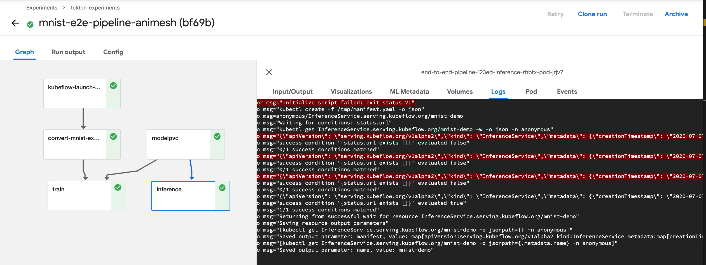

# Deploy to KFServing from [Kubeflow Pipelines](https://www.kubeflow.org/docs/pipelines/overview/pipelines-overview/)

## Kubeflow Pipelines KFServing component

The following examples illustrate how to use the Kubeflow Pipelines component for KFServing using the v1beta1 API.
These assume your cluster has a KFServing version >= v0.5.0.

* Deploy a [custom model](./sample-custom-model.py).
* Deploy a [TensorFlow model](./sample-tf-pipeline.py). There is also [a notebook](./kfs-pipeline.ipynb) which illustrates this.

Additional usage instructions can be found in the component [README](https://github.com/kubeflow/pipelines/blob/master/components/kubeflow/kfserving/README.md).
To dive into the source behind the KFServing Kubeflow Pipelines Component, please look into the YAML for the [KFServing Component](https://github.com/kubeflow/pipelines/blob/master/components/kubeflow/kfserving/component.yaml) and the [source code](https://github.com/kubeflow/pipelines/blob/master/components/kubeflow/kfserving/src/kfservingdeployer.py).

**Note**: For those still using an older version of KFServing less than v0.5.0, an older version of the KFServing Pipelines component must be used
as demonstrated in [this notebook](./kfs-pipeline-v1alpha2.ipynb). The source code for this version of the component can be found [here](https://github.com/kubeflow/pipelines/tree/65bed9b6d1d676ef2d541a970d3edc0aee12400d/components/kubeflow/kfserving).

## End to end pipeline example using KFServing

Deploy a sample [MNIST model end to end using Kubeflow Pipelines with Tekton](https://github.com/kubeflow/kfp-tekton/tree/master/samples/e2e-mnist). The [notebook](https://github.com/kubeflow/kfp-tekton/blob/master/samples/e2e-mnist/mnist.ipynb) demonstrates how to compile and execute an End to End Machine Learning workflow that uses Katib, TFJob, KFServing, and Tekton pipeline. This pipeline contains 5 steps, it finds the best hyperparameter using Katib, creates PVC for storing models, processes the hyperparameter results, distributedly trains the model on TFJob with the best hyperparameter using more iterations, and finally serves the model using KFServing. You can visit [this medium blog](https://medium.com/@liuhgxa/an-end-to-end-use-case-by-kubeflow-b2f72b0b587) for more details on this pipeline.

