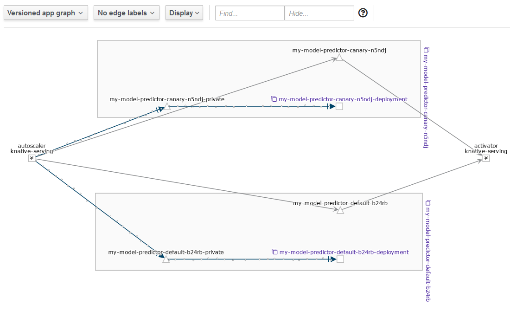
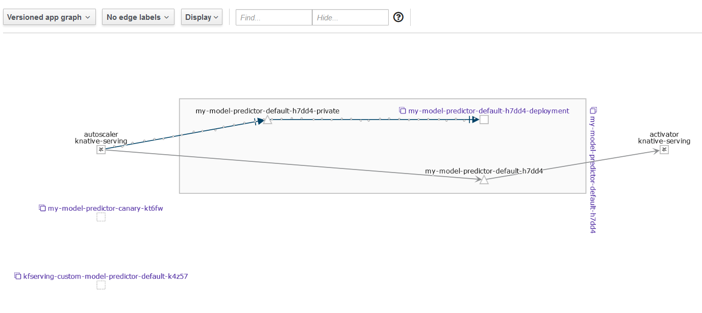
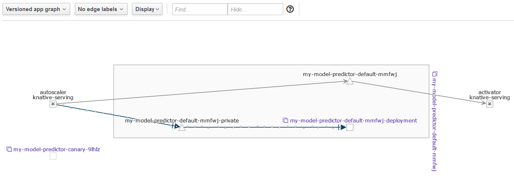

# Setting up canary rollouts in an Inferenceservice
To test a canary rollout, you can use the canary.yaml, which declares a canary model that is set to receive 10% of requests.

## Setup
1. Your ~/.kube/config should point to a cluster with [KFServing installed](https://github.com/kubeflow/kfserving/blob/master/docs/DEVELOPER_GUIDE.md#deploy-kfserving).
2. Your cluster's Istio Ingress gateway must be network accessible.

## Create the InferenceService

Apply the CR:
```
kubectl apply -f canary.yaml 
```

## Verifying split traffic

To verify if your traffic split percentage is applied correctly, you can use the following command:

```
kubectl get inferenceservices
NAME       URL                                                      READY   DEFAULT TRAFFIC   CANARY TRAFFIC   AGE
my-model   http://my-model.default.example.com/v1/models/my-model   True    90                10               42m
```

There should also be two pods:
```
kubectl get pods
NAME                                                           READY   STATUS    RESTARTS   AGE
my-model-predictor-canary-t5njm-deployment-74dcd94f57-l7lbn    2/2     Running   0          18s
my-model-predictor-default-wfgrl-deployment-75c7845fcb-v5g7r   2/2     Running   0          49s
```

```
MODEL_NAME=my-model
INPUT_PATH=@./input.json
INGRESS_GATEWAY=istio-ingressgateway
CLUSTER_IP=$(kubectl -n istio-system get service $INGRESS_GATEWAY -o jsonpath='{.status.loadBalancer.ingress[0].ip}')
SERVICE_HOSTNAME=$(kubectl get inferenceservice ${MODEL_NAME} -o jsonpath='{.status.url}' | cut -d "/" -f 3)

curl -v -H "Host: ${SERVICE_HOSTNAME}" http://$CLUSTER_IP/v1/models/$MODEL_NAME:predict -d $INPUT_PATH
```

Expected Output:
```
*   Trying 169.47.250.204...
* TCP_NODELAY set
* Connected to 169.47.250.204 (169.47.250.204) port 80 (#0)
> POST /v1/models/my-model:predict HTTP/1.1
> Host: my-model.default.example.com
> User-Agent: curl/7.58.0
> Accept: */*
> Content-Length: 16201
> Content-Type: application/x-www-form-urlencoded
> Expect: 100-continue
> 
< HTTP/1.1 100 Continue
* We are completely uploaded and fine
< HTTP/1.1 200 OK
< content-length: 220
< content-type: application/json
< date: Fri, 21 Feb 2020 02:20:28 GMT
< x-envoy-upstream-service-time: 19581
< server: istio-envoy
< 
{
    "predictions": [
        {
            "prediction": 0,
            "key": "   1",
            "scores": [0.999114931, 9.2098875e-05, 0.000136786344, 0.000337257865, 0.000300532876, 1.8481378e-05]
        }
    ]
* Connection #0 to host 169.47.250.204 left intact
```

You can use the Kiali console to visually verify that traffic is being routed to both models. First, expose the console locally:
```
kubectl port-forward svc kiali -n istio-system 20001:20001
```

Now you can access the console at `localhost:20001/kiali` with credentials admin/admin. Navigate to the **Graph** perspective, select **Versioned app graph** in the first drop down, and check **Traffic Animation** in the **Display** drop down. While looking at the **Versioned app graph**, keep running predictions. Eventually you will see that traffic is being sent to both models.

Expected Kiali graph:


If you stop making requests to the application, you should eventually see that your application scales itself back down to the number of `minReplicas` (default is 1 for KFServing v0.3+, and 0 for lower versions). You should also eventually see the traffic animation in the Kiali graph disappear.

## Pinned canary
The canary model can also be pinned and receive no traffic as shown in the pinned.yaml. Applying this after you have applied the canary.yaml would essentially be rolling back the canary model.

Apply the CR:
```
kubectl apply -f pinned.yaml
```

As before there will be two pods, but if you run:
```
kubectl get inferenceservices
NAME       URL                                                      READY   DEFAULT TRAFFIC   CANARY TRAFFIC   AGE
my-model   http://my-model.default.example.com/v1/models/my-model   True    100                                53s
```

The output will show that all the traffic is going to the default model. You may run predictions again while watching the Kiali console to visually verify that all traffic is routed to the default model.

Expected Kiali graph:


## Promoting canary
The canary model can also be promoted by applying the promotion.yaml after either the pinned.yaml and/or the canary.yaml.

Apply the CR:
```
kubectl apply -f promotion.yaml
```

Similar to the pinned.yaml example, there will be two pods and all traffic is going to the default model (promoted canary model):
```
kubectl get inferenceservices
NAME       URL                                                      READY   DEFAULT TRAFFIC   CANARY TRAFFIC   AGE
my-model   http://my-model.default.example.com/v1/models/my-model   True    100                                53s
```

You may run predictions again while watching the Kiali console to visually verify that all traffic is routed to the promoted canary model.

Expected Kiali graph:

