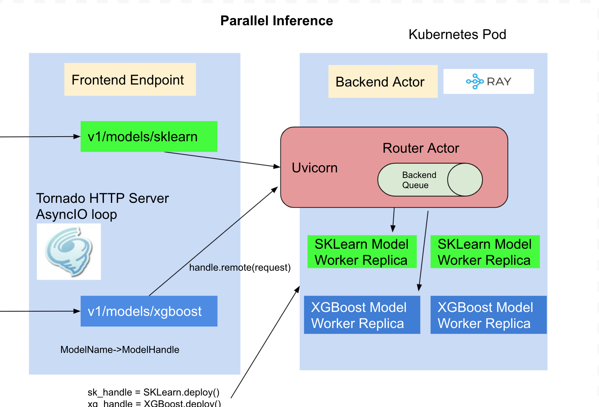

# Deploy Custom Python Model with KFServer API
When out of the box model server does not fit your need, you can build your own model server using KFServer API and use the
following source to serving workflow to deploy your custom models to KServe.

## Setup
1. Your ~/.kube/config should point to a cluster with [KServe installed](https://github.com/kserve/kserve#installation).
2. Your cluster's Istio Ingress gateway must be [network accessible](https://istio.io/latest/docs/tasks/traffic-management/ingress/ingress-control/).
3. Install [pack CLI](https://buildpacks.io/docs/tools/pack/) to build your custom model server image.

## Create your custom Model Server by extending Model
`KServe.Model` base class mainly defines three handlers `preprocess`, `predict` and `postprocess`, these handlers are executed
in sequence, the output of the `preprocess` is passed to `predict` as the input, the `predictor` handler should execute the
inference for your model, the `postprocess` handler then turns the raw prediction result into user-friendly inference response. There
is an additional `load` handler which is used for writing custom code to load your model into the memory from local file system or
remote model storage, a general good practice is to call the `load` handler in the model server class `__init__` function, so your model
is loaded on startup and ready to serve when user is making the prediction calls.

```python
import kserve
from typing import Dict

class AlexNetModel(kserve.Model):
    def __init__(self, name: str):
       super().__init__(name)
       self.name = name
       self.load()

    def load(self):
        pass

    def predict(self, request: Dict) -> Dict:
        pass

if __name__ == "__main__":
    model = AlexNetModel("custom-model")
    kserve.ModelServer().start([model])
```

## Build the custom image with Buildpacks
[Buildpacks](https://buildpacks.io/) allows you to transform your inference code into images that can be deployed on KServe without
needing to define the `Dockerfile`. Buildpacks automatically determines the python application and then install the dependencies from the
`requirements.txt` file, it looks at the `Procfile` to determine how to start the model server. Here we are showing how to build the serving
image manually with `pack`, you can also choose to use [kpack](https://github.com/pivotal/kpack)
to run the image build on the cloud and continuously build/deploy new versions from your source git repository.

### Use pack to build and push the custom model server image
```bash
pack build --builder=heroku/buildpacks:20 ${DOCKER_USER}/custom-model:v1
docker push ${DOCKER_USER}/custom-model:v1
```

## Parallel Inference
By default the model is loaded and inference is ran in the same process as tornado http server, if you are hosting multiple models
the inference can only be run for one model at a time which limits the concurrency when you share the container for the models.
KServe integrates [RayServe](https://docs.ray.io/en/master/serve/index.html) which provides a programmable API to deploy models
as separate python workers so the inference can be ran in parallel.

```python
import kserve
from typing import Dict
from ray import serve

@serve.deployment(name="custom-model", config={"num_replicas": 2})
class AlexNetModel(kserve.Model):
    def __init__(self):
       self.name = "custom-model"
       super().__init__(self.name)
       self.load()

    def load(self):
        pass

    def predict(self, request: Dict) -> Dict:
        pass

if __name__ == "__main__":
    kserve.ModelServer().start({"custom-model": AlexNetModel})
```

Modify the `Procfile` to `web: python -m model_remote` and then run the above `pack` command, it builds the serving image which launches
each model as separate python worker and tornado webserver routes to the model workers by name. 




## Deploy Locally and Test
Launch the docker image built from last step with `buildpack`.
```bash
docker run -ePORT=8080 -p8080:8080 ${DOCKER_USER}/custom-model:v1
```

Send a test inference request locally
```bash
curl localhost:8080/v1/models/custom-model:predict -d @./input.json

{"predictions": [[14.861763000488281, 13.94291877746582, 13.924378395080566, 12.182709693908691, 12.00634765625]]}
```

## Deploy to KServe
### Create the InferenceService

In the `custom.yaml` file edit the container image and replace {username} with your Docker Hub username.

Apply the CRD

```
kubectl apply -f custom.yaml
```

Expected Output

```
$ inferenceservice.serving.kubeflow.org/custom-model created
```

### Arguments and Environment Variables
You can supply additional command arguments on the container spec to configure the model server.
- `--workers`: fork the specified number of model server workers(multi-processing), the default value is 1. If you start the server after model is loaded
you need to make sure model object is fork friendly for multi-processing to work. Alternatively you can decorate your model server
class with replicas and in this case each model server is created as a python worker independent of the server.
- `--http_port`: the http port model server is listening on, the default port is 8080 
- `--max_buffer_size`: Max socker buffer size for tornado http client, the default limit is 10Mi.
- `--max_asyncio_workers`: Max number of workers to spawn for python async io loop, by default it is `min(32,cpu.limit + 4)`

### Run a prediction
The first step is to [determine the ingress IP and ports](../../../../../README.md#determine-the-ingress-ip-and-ports) and set `INGRESS_HOST` and `INGRESS_PORT`

```
MODEL_NAME=custom-model
INPUT_PATH=@./input.json
SERVICE_HOSTNAME=$(kubectl get inferenceservice ${MODEL_NAME} -o jsonpath='{.status.url}' | cut -d "/" -f 3)

curl -v -H "Host: ${SERVICE_HOSTNAME}" http://${INGRESS_HOST}:${INGRESS_PORT}/v1/models/${MODEL_NAME}:predict -d $INPUT_PATH
```

Expected Output:

```
*   Trying 169.47.250.204...
* TCP_NODELAY set
* Connected to 169.47.250.204 (169.47.250.204) port 80 (#0)
> POST /v1/models/custom-model:predict HTTP/1.1
> Host: custom-model.default.example.com
> User-Agent: curl/7.64.1
> Accept: */*
> Content-Length: 105339
> Content-Type: application/x-www-form-urlencoded
> Expect: 100-continue
>
< HTTP/1.1 100 Continue
* We are completely uploaded and fine
< HTTP/1.1 200 OK
< content-length: 232
< content-type: text/html; charset=UTF-8
< date: Wed, 26 Feb 2020 15:19:15 GMT
< server: istio-envoy
< x-envoy-upstream-service-time: 213
<
* Connection #0 to host 169.47.250.204 left intact
{"predictions": [[14.861762046813965, 13.942917823791504, 13.9243803024292, 12.182711601257324, 12.00634765625]]}
```

### Delete the InferenceService

```
kubectl delete -f custom.yaml
```

