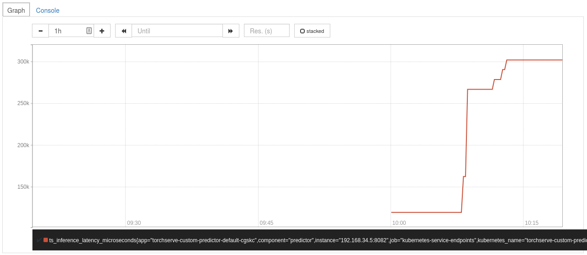

# Metrics

This adds prometheus and grafana to the cluster with some default metrics.

## Setup

1. Your ~/.kube/config should point to a cluster with [KServe installed](https://github.com/kserve/kserve#installation).
2. Your cluster's Istio Ingress gateway must be [network accessible](https://istio.io/latest/docs/tasks/traffic-management/ingress/ingress-control/).

## Enable request metrics

```bash
Kubectl edit cm -n knative-serving config-observability
```

Add `metrics.request-metrics-backend-destination: prometheus` to data field. You can find detailed information in `data._example` field in the ConfigMap you are editing.

## Add Prometheus and Grafana

Create namespace

```bash
Kubectl create namespace knative-monitoring

kubectl apply -f https://github.com/knative/serving/releases/download/v0.17.0/monitoring-metrics-prometheus.yaml
```

## Check pods are up and running

```bash
kubectl get pods --namespace knative-monitoring
```

## Forward Prometheus and Grafana ports

```bash
# Grafana
kubectl port-forward --namespace knative-monitoring $(kubectl get pods --namespace knative-monitoring \
--selector=app=grafana --output=jsonpath="{.items..metadata.name}") 3000

# Prometheus
kubectl port-forward -n knative-monitoring $(kubectl get pods -n knative-monitoring \
--selector=app=prometheus --output=jsonpath="{.items[0].metadata.name}") 9090
```

## Access prometheus and grafana

Grafana and Prometheus can be accessed from the below links

Link: [Prometheus](http://localhost:9090/)

Link: [Grafana](http://localhost:3000/)

Logout and login as admin with username: admin and password: admin

## For Torchserve

### config.properties

Enable metrics in config.properties

```json
metrics_address=http://0.0.0.0:8082
enable_metrics_api=true
metrics_format=prometheus
```

### Deployment yaml

Enable prometheus scraping by adding annotations to deployment yaml. Here our torchserve's metrics port is 8082.

```yaml
apiVersion: "serving.kserve.io/v1beta1"
kind: "InferenceService"
metadata:
  name: torchserve-custom
  annotations:
    prometheus.io/scrape: 'true'
    prometheus.io/port: '8082'
spec:
  predictor:
    containers:
    - image: {username}/torchserve:latest
      name: torchserve-container
```

## Create the InferenceService

Apply the CRD

```bash
kubectl apply -f torchserve-custom.yaml
```

Expected Output

```bash
$inferenceservice.serving.kserve.io/torchserve-custom created
```

## Run a prediction

The first step is to [determine the ingress IP and ports](../../../../../../README.md#determine-the-ingress-ip-and-ports) and set `INGRESS_HOST` and `INGRESS_PORT`

## Inference

```bash
MODEL_NAME=torchserve-custom
SERVICE_HOSTNAME=$(kubectl get inferenceservice ${MODEL_NAME} <namespace> -o jsonpath='{.status.url}' | cut -d "/" -f 3)

curl -v -H "Host: ${SERVICE_HOSTNAME}" http://${INGRESS_HOST}:${INGRESS_PORT}/predictions/mnist -T serve/examples/image_classifier/test_data/0.png
```

Expected Output

```bash
*   Trying 52.89.19.61...
* Connected to a881f5a8c676a41edbccdb0a394a80d6-2069247558.us-west-2.elb.amazonaws.com (52.89.19.61) port 80 (#0)
> PUT /predictions/mnist HTTP/1.1
> Host: torchserve-custom.kfserving-test.example.com
> User-Agent: curl/7.47.0
> Accept: */*
> Content-Length: 272
> Expect: 100-continue
>
< HTTP/1.1 100 Continue
* We are completely uploaded and fine
< HTTP/1.1 200 OK
< cache-control: no-cache; no-store, must-revalidate, private
< content-length: 1
< date: Fri, 23 Oct 2020 13:01:09 GMT
< expires: Thu, 01 Jan 1970 00:00:00 UTC
< pragma: no-cache
< x-request-id: 8881f2b9-462e-4e2d-972f-90b4eb083e53
< x-envoy-upstream-service-time: 5018
< server: istio-envoy
<
* Connection #0 to host a881f5a8c676a41edbccdb0a394a80d6-2069247558.us-west-2.elb.amazonaws.com left intact
0
```

### Adding data source

#### Prometheus graph view

* Navigate to prometheus page
* Add a query in the prometheus page




#### Grafana dashboard

* Navigate to grafana page
* Add a dashboard from the top left + symbol
* Click add query and enter the query
  


Add Prometheus data source to Grafana to visualize metrics.
Link: [Add datasource](https://prometheus.io/docs/visualization/grafana/)