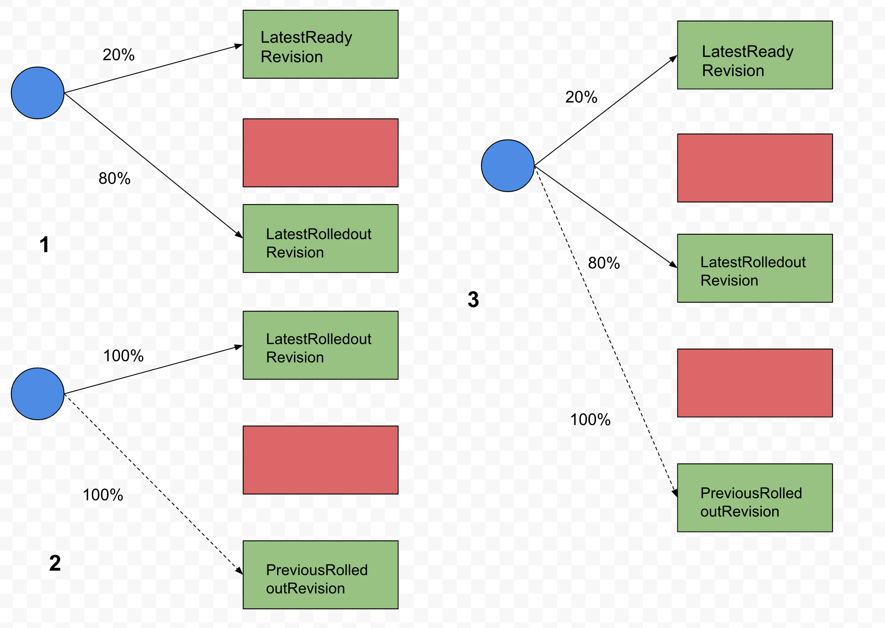

# Rollout InferenceService with Canary Strategy

## Setup
1. Your ~/.kube/config should point to a cluster with [KFServing installed](https://github.com/kubeflow/kfserving/#install-kfserving).
2. Your cluster's Istio Ingress gateway must be [network accessible](https://istio.io/latest/docs/tasks/traffic-management/ingress/ingress-control/).

## Create the InferenceService
In v1beta1 you no longer need to specify both default and canary spec on `InferenceService` to rollout the `InferenceService` with canary strategy, 
KFServing automatically tracks the last good revision that was rolled out with 100% traffic, you only need to set the `canaryTrafficPercent` field on the component
and KFServing automatically splits the traffic between the revision that is currently rolling out and the last known good revision that had 100% traffic rolled out.



### Create the InferenceService with the initial model
```yaml
apiVersion: "serving.kubeflow.org/v1beta1"
kind: "InferenceService"
metadata:
  name: "my-model"
spec:
  predictor:
    tensorflow:
      storageUri: "gs://kfserving-samples/models/tensorflow/flowers"
```
Apply the CR:
```
kubectl apply -f default.yaml 
```

After rolling out the first model, 100% traffic goes to the initial model with service revision 1.

```
kubectl get isvc my-model
NAME       URL                                   READY   DEFAULT   CANARY   PREVIOUSROLLEDOUT   LATESTREADY                        AGE
my-model   http://my-model.default.example.com   True              100                          my-model-predictor-default-2vp5n   12h                               2m39s                             70s
```

### Update the InferenceService with the canary model
```yaml
apiVersion: "serving.kubeflow.org/v1beta1"
kind: "InferenceService"
metadata:
  name: "my-model"
spec:
  predictor:
    # 10% of traffic is sent to this model
    canaryTrafficPercent: 10
    tensorflow:
      storageUri: "gs://kfserving-samples/models/tensorflow/flowers-2"
```

Now you update the `storageUri` for the new model and apply the CR:
```
kubectl apply -f canary.yaml 
```

After rolling out the canary model, traffic is split between the latest ready revision and the previously rolled out revision 1.

```
kubectl get isvc my-model 
NAME       URL                                   READY   PREV   LATEST   PREVROLLEDOUTREVISION              LATESTREADYREVISION                AGE
my-model   http://my-model.default.example.com   True    90     10       my-model-predictor-default-2vp5n   my-model-predictor-default-jdn59   12h
```

You should see two sets of pods running for the two models for both first and second generation revision:
```
kubectl get pods -l serving.kubeflow.org/inferenceservice=my-model
NAME                                                           READY   STATUS    RESTARTS   AGE
my-model-predictor-default-2vp5n-deployment-8569645df4-tq8jc   2/2     Running   0          14m
my-model-predictor-default-jdn59-deployment-58bd86ff68-qkkgb   2/2     Running   0          12m
```

#### Run a prediction
The first step is to [determine the ingress IP and ports](../../../../README.md#determine-the-ingress-ip-and-ports) and set `INGRESS_HOST` and `INGRESS_PORT`

```
MODEL_NAME=my-model
INPUT_PATH=@./input.json
SERVICE_HOSTNAME=$(kubectl get isvc ${MODEL_NAME} -o jsonpath='{.status.url}' | cut -d "/" -f 3)

curl -v -H "Host: ${SERVICE_HOSTNAME}" http://${INGRESS_HOST}:${INGRESS_PORT}/v1/models/$MODEL_NAME:predict -d $INPUT_PATH
```

Expected Output:
```
*   Trying 169.47.250.204...
* TCP_NODELAY set
* Connected to 169.47.250.204 (169.47.250.204) port 80 (#0)
> POST /v1/models/my-model:predict HTTP/1.1
> Host: my-model.default.example.com
> User-Agent: curl/7.58.0
> Accept: */*
> Content-Length: 16201
> Content-Type: application/x-www-form-urlencoded
> Expect: 100-continue
> 
< HTTP/1.1 100 Continue
* We are completely uploaded and fine
< HTTP/1.1 200 OK
< content-length: 220
< content-type: application/json
< date: Fri, 21 Feb 2020 02:20:28 GMT
< x-envoy-upstream-service-time: 19581
< server: istio-envoy
< 
{
    "predictions": [
        {
            "prediction": 0,
            "key": "   1",
            "scores": [0.999114931, 9.2098875e-05, 0.000136786344, 0.000337257865, 0.000300532876, 1.8481378e-05]
        }
    ]
* Connection #0 to host 169.47.250.204 left intact
```

Send more requests to the `InferenceService` you will notice 20% of time the traffic goes to the new revision.

### Promoting canary
If the canary model runs well you can promote it by removing the `canaryTrafficPercent` field.
```yaml
apiVersion: "serving.kubeflow.org/v1beta1"
kind: "InferenceService"
metadata:
  name: "my-model"
spec:
  predictor:
    tensorflow:
      storageUri: "gs://kfserving-samples/models/tensorflow/flowers-2"
```

Apply the CR:
```
kubectl apply -f promotion.yaml
```

Now all traffic goes to the revision 2 for the new model.
```
kubectl get isvc my-model
NAME       URL                                   READY   PREV   LATEST   PREVROLLEDOUTREVISION   LATESTREADYREVISION                AGE
my-model   http://my-model.default.example.com   True           100                              my-model-predictor-default-jdn59   12h
```

The pods for revision generation 1 automatically scales down to 0 as it is no longer getting the traffic.
```bash
kubectl get pods -l serving.kubeflow.org/inferenceservice=my-model
NAME                                                           READY   STATUS        RESTARTS   AGE
my-model-predictor-default-2vp5n-deployment-8569645df4-tq8jc   1/2     Terminating   0          15m
my-model-predictor-default-jdn59-deployment-58bd86ff68-qkkgb   2/2     Running       0          13m
```

## Rollback and pin the model
The model can also be pinned to the previous good model and make the current model receive no traffic. 
```yaml
apiVersion: "serving.kubeflow.org/v1beta1"
kind: "InferenceService"
metadata:
  name: "my-model"
spec:
  predictor:
    canaryTrafficPercent: 0
    tensorflow:
      storageUri: "gs://kfserving-samples/models/tensorflow/flowers-2"
```

Applying this CR essentially rolls back the new model to the previous good model which was rolled out with 100% traffic.
```
kubectl apply -f pinned.yaml
```

Check the traffic split, now 100% traffic goes to the previous good model for revision generation 1.
```
kubectl get isvc my-model
NAME       URL                                   READY   PREV   LATEST   PREVROLLEDOUTREVISION              LATESTREADYREVISION                AGE
my-model   http://my-model.default.example.com   True    100    0        my-model-predictor-default-2vp5n   my-model-predictor-default-jdn59   12h
```

The pods for previous revision 1 now scales back
```
kubectl get pods -l serving.kubeflow.org/inferenceservice=my-model
NAME                                                           READY   STATUS            RESTARTS   AGE
my-model-predictor-default-2vp5n-deployment-8569645df4-g2qzd   0/2     PodInitializing   0          11s
my-model-predictor-default-jdn59-deployment-58bd86ff68-qkkgb   2/2     Running           0          17m
```
