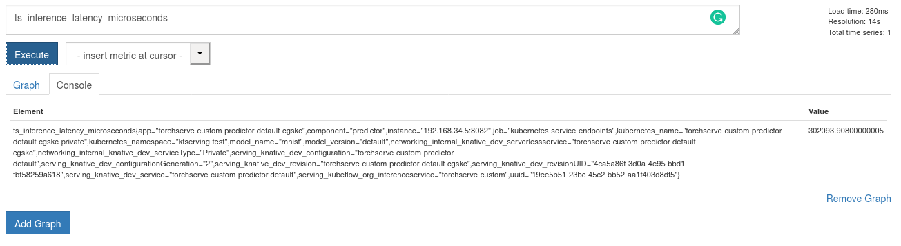
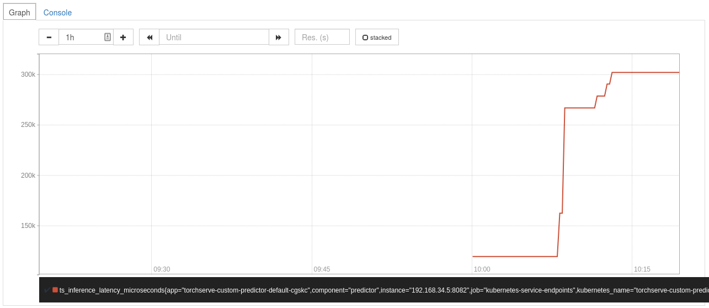
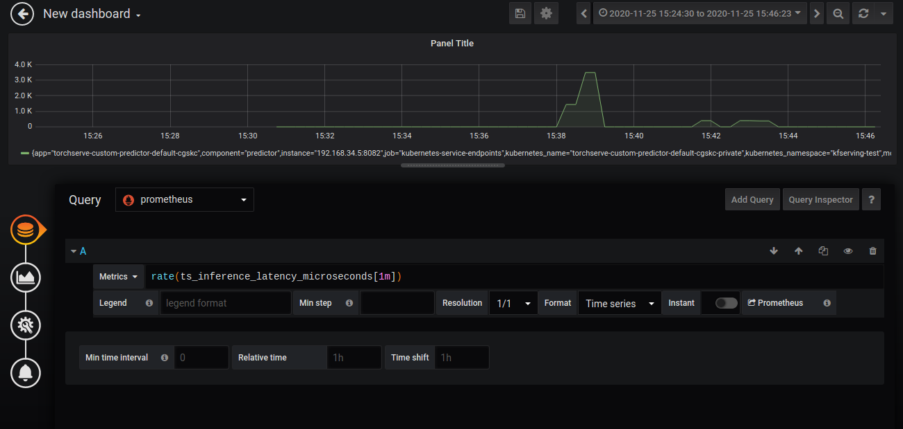

# Metrics

This adds prometheus and grafana to the cluster with some default metrics.

## Setup

1. Your ~/.kube/config should point to a cluster with [KServe installed](https://github.com/kserve/kserve#installation).
2. Your cluster's Istio Ingress gateway must be [network accessible](https://istio.io/latest/docs/tasks/traffic-management/ingress/ingress-control/).

##  Open the Istio Dashboard via the Grafana UI and Prometheus UI

__**Note:**__ Make sure to enable prometheus and grafana while installing istio.

## Access prometheus and grafana

Grafana and Prometheus can be accessed from the below links

```bash
# Grafana
istioctl dashboard grafana

# Prometheus
istioctl dashboard prometheus
```

### Deployment yaml

Enable prometheus scraping by adding annotations to deployment yaml. Here our torchserve's metrics port is 8082.

```yaml
apiVersion: serving.kserve.io/v1beta1
kind: InferenceService
metadata:
  name: "torch-metrics"
  annotations:
    prometheus.io/scrape: 'true'
    prometheus.io/port: '8082'
spec:
  predictor:
    pytorch:
      storageUri: gs://kfserving-examples/models/torchserve/image_classifier
```

## Create the InferenceService

Apply the CRD

```bash
kubectl apply -f metrics.yaml
```

Expected Output

```bash
$inferenceservice.serving.kserve.io/torch-metrics created
```

## Run a prediction

The first step is to [determine the ingress IP and ports](../../../../../README.md#determine-the-ingress-ip-and-ports) and set `INGRESS_HOST` and `INGRESS_PORT`

## Inference

```bash
MODEL_NAME=mnist
SERVICE_HOSTNAME=$(kubectl get inferenceservice torch-metrics <namespace> -o jsonpath='{.status.url}' | cut -d "/" -f 3)

curl -v -H "Host: ${SERVICE_HOSTNAME}" http://${INGRESS_HOST}:${INGRESS_PORT}/v1/models/${MODEL_NAME}:predict -d @./mnist.json
```

Expected Output

```bash
*   Trying 52.89.19.61...
* Connected to a881f5a8c676a41edbccdb0a394a80d6-2069247558.us-west-2.elb.amazonaws.com (52.89.19.61) port 80 (#0)
> PUT /v1/models/mnist:predict HTTP/1.1
> Host: torch-metrics.kfserving-test.example.com
> User-Agent: curl/7.47.0
> Accept: */*
> Content-Length: 272
> Expect: 100-continue
>
< HTTP/1.1 100 Continue
* We are completely uploaded and fine
< HTTP/1.1 200 OK
< cache-control: no-cache; no-store, must-revalidate, private
< content-length: 1
< date: Fri, 23 Oct 2020 13:01:09 GMT
< expires: Thu, 01 Jan 1970 00:00:00 UTC
< pragma: no-cache
< x-request-id: 8881f2b9-462e-4e2d-972f-90b4eb083e53
< x-envoy-upstream-service-time: 5018
< server: istio-envoy
<
* Connection #0 to host a881f5a8c676a41edbccdb0a394a80d6-2069247558.us-west-2.elb.amazonaws.com left intact
{"predictions": ["2"]}
```

### Adding data source

#### Prometheus graph view

* Navigate to prometheus page
* Add a query in the prometheus page




#### Grafana dashboard

* Navigate to grafana page
* Add a dashboard from the top left + symbol
* Click add query and enter the query
  


Add Prometheus data source to Grafana to visualize metrics.
Link: [Add datasource](https://prometheus.io/docs/visualization/grafana/)

For Exposing grafana and prometheus under istio ingress refer.[Remotely accessing telemetry addons](https://istio.io/latest/docs/tasks/observability/gateways/)

Apply below deployment

```yaml
apiVersion: networking.istio.io/v1alpha3
kind: Gateway
metadata:
  name: grafana-gateway
  namespace: istio-system
spec:
  selector:
    istio: ingressgateway
  servers:
  - port:
      number: 80
      name: http-grafana
      protocol: HTTP
    hosts:
    - "grafana.example.com"
---
apiVersion: networking.istio.io/v1alpha3
kind: VirtualService
metadata:
  name: grafana-vs
  namespace: istio-system
spec:
  hosts:
  - "grafana.example.com"
  gateways:
  - grafana-gateway
  http:
  - route:
    - destination:
        host: grafana
        port:
          number: 3000
---
apiVersion: networking.istio.io/v1alpha3
kind: DestinationRule
metadata:
  name: grafana
  namespace: istio-system
spec:
  host: grafana
  trafficPolicy:
    tls:
      mode: DISABLE
---
```

All request with hostname `grafana.example.com` redirects to grafana.
